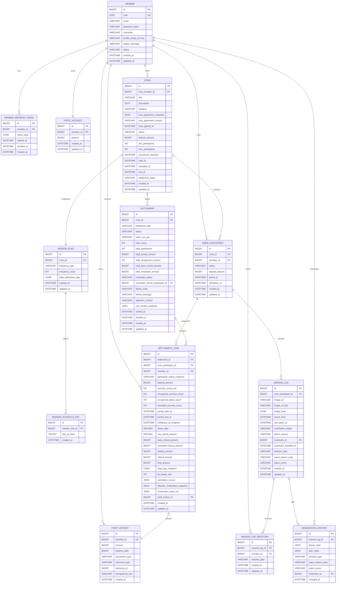

# ERD 초안: Dondok MVP

기준 문서:

- [PRD-dondok.md](./PRD-dondok.md)
- [Settlement-design.md](./Settlement-design.md)

## 1. ERD 설계 원칙

### 1.1 Aggregate / 도메인 경계

- `member`는 계정과 인증의 주체다. 포인트 잔액과 원장은 모두 `member`를 기준으로 연결한다.
- `crew`는 크루 모집과 진행의 루트 aggregate다. `crew_participant`, `mission_rule`, `mission_schedule_day`가 여기에 소속된다.
- `mission_log`는 `crew_participant`의 인증 기록이다. `Settlement.status = SUCCEEDED` 전 계산 입력으로 이 로그와 참여자 상태를 다시 읽는다.
- `settlement`는 `crew` 종료 이후의 정산 aggregate다. `settlement_item`은 참여자별 계산 스냅샷을 가지며, 성공 정산 이후 운영/분쟁/조회 기준이 된다.
- `point_history`는 포인트 원장 aggregate이자 금액 source of truth다. 사용 가능 잔액의 증감과 보증금 잠금/환급 반영을 기록하고, `point_account.balance`는 이 원장에서 재계산 가능한 캐시로 둔다.
- `total_locked_amount` 같은 정산 집계 스냅샷은 `point_account`나 `point_history` 재합산이 아니라 `crew_participant.deposit_amount` 기준으로 고정한다.

### 1.2 정산 원천 데이터

- `Settlement.status = SUCCEEDED` 전 정산 계산 입력은 `mission_log`, `crew_participant`, `crew`, `mission_rule`, `mission_schedule_day`다.
- `settlement`와 `settlement_item`은 원천 로그를 다시 계산한 결과와 근거를 남기는 스냅샷이다.
- Replay는 historical semantic truth reconstruction이다. `algorithm_version`, frozen participant baseline, deposit snapshot, recognized success counts, all-fail/remainder policy, cadence interpretation, timezone/cutoff semantics, lifecycle cutoff semantics, effective moderation state, append-only moderation chain reference, reason-code mapping version을 설명 가능하게 보존해야 한다.
- `Settlement.status = SUCCEEDED` 이후 운영/분쟁/조회 기준은 `settlement_item`과 연결된 `point_history`다. 이후 `MissionLog` 기반 replay는 감사/디버깅 검증용이지 지급 결과를 대체하거나 변경하는 기준이 아니다.
- 현재 기준 지분율/projection, 통계성 캐시, `point_account.balance`는 source of truth가 아니다. 필요해도 정산 계산이나 분쟁 판단의 최종 기준으로 쓰지 않는다.

### 1.3 Canonical Freeze v1 데이터 경계

- Host moderation authority는 settlement authority가 아니다. 방장 검수/조정 이력은 정산 입력을 설명할 수는 있어도 freeze 이후의 정산/일별 결과를 직접 수정하는 권한으로 모델링하지 않는다.
- 72h grace는 pre-freeze certification review/correction window다. 최종 3일 미션 결과는 grace 없이 즉시 freeze되며, post-freeze hidden mutation은 금지된다. Support correction은 별도 운영 의미 후보이며 settlement snapshot/ledger overwrite로 모델링하지 않는다.
- `NOTIFY-003`은 projection 기반 알림이며 final settlement guarantee가 아니다. ERD에서는 알림을 정산 source of truth로 모델링하지 않는다. 상세 event contract는 `API-spec`의 projection boundary를 따른다.
- `point_history`는 authoritative append-only ledger이고, `point_account.balance`는 `point_history`에서 재계산 가능한 projection/cache layer다. 불일치 시 원장 기준으로 원인을 조사하고 캐시를 보정한다.
- 최소 인원 baseline, activation eligibility, frozen participant baseline에는 `JOINED` participant만 포함한다. `APPLIED`/`REJECTED`/`CANCELLED`/`EXPIRED`는 baseline/activation 대상이 아니다.
- Scheduler/runtime 실행 지연은 audit/recovery fact이며 lifecycle authority가 아니다. `start_at`, crew timezone, daily cutoff, mission period end 같은 scheduled semantic anchor가 eligibility와 cutoff의 기준이다.
- Authoritative moderation persistence는 effective state, transition, reason-code, actor, timestamp, append-only chain reference를 남기는 transition ledger 성격이다. Human memo/support note/UX wording/operational comment는 non-authoritative context로 분리한다.

### 1.4 논리 삭제 정책

- `crew_participant`는 물리 삭제하지 않고 participation lifecycle 상태로 관리한다. MVP 활성 기준에서는 `JOINED`만 minimum baseline, activation eligibility, frozen participant baseline, settlement 대상 후보다. `APPLIED`/`REJECTED`/`CANCELLED`/`EXPIRED`는 baseline/settlement 대상이 아니다. `WITHDRAWN`/active withdrawal/rejoin은 MVP active status가 아니고 Phase 2/deferred brownfield reference로만 남긴다.
- `mission_log`, `settlement`, `settlement_item`, `point_history`는 감사 추적을 위해 append-only에 가깝게 다룬다.
- `crew.settlement_status`는 필요 시 조회 최적화용 비정규화 필드로 둘 수 있지만, 원천 상태는 항상 `settlement.status`다.

### 1.5 Unique 제약 원칙

- 사용자 참여 불변식은 DB에서 강제한다. 핵심 제약은 `unique(crew_id, member_id)`다.
- 정산 헤더 중복 생성은 `unique(crew_id, settlement_type)`로 막는다.
- 정산 아이템 중복 생성은 `unique(settlement_id, crew_participant_id)`로 막는다.
- 포인트 중복 반영은 `unique(point_history.idempotency_key)`로 막는다.
- 분산 락은 보조 수단이고, 최종 방어선은 DB unique와 조건부 update다.

## 2. 테이블 목록 요약

### 2.1 Core

| 테이블명               | 역할                                | 핵심 관계                                                                 |
| ---------------------- | ----------------------------------- | ------------------------------------------------------------------------- |
| `member`               | 사용자 계정의 기준 엔티티           | `member 1:N crew_participant`, `member 1:1 point_account`                 |
| `member_refresh_token` | JWT refresh token 저장              | `member 1:N member_refresh_token`                                         |
| `point_account`        | 현재 사용 가능 포인트 잔액          | `member 1:1 point_account`                                                |
| `point_history`        | 포인트 증감과 보증금 잠금/환급 원장 | `member 1:N point_history`, `settlement_item 0..1:1 point_history`        |
| `crew`                 | 크루 모집, 진행, 종료 단위          | `member 1:N crew(host)`, `crew 1:N crew_participant`                      |
| `crew_participant`     | 방 참여 단위이자 보증금 잠금 단위   | `crew 1:N crew_participant`, `crew_participant 1:N mission_log`           |
| `mission_rule`         | 인증 주기 규칙                      | `crew 1:1 mission_rule`                                                   |
| `mission_schedule_day` | `SPECIFIC_DAYS` 요일 규칙           | `mission_rule 1:N mission_schedule_day`                                   |
| `mission_log`          | 미션 인증 원본 로그                 | `crew_participant 1:N mission_log`                                        |
| `mission_log_reaction` | 인증 성공 피드 리액션               | `mission_log 1:N mission_log_reaction`, `member 1:N mission_log_reaction` |
| `settlement`           | 방 종료 후 정산 헤더                | `crew 1:N settlement`                                                     |
| `settlement_item`      | 참여자별 정산 스냅샷과 결과         | `settlement 1:N settlement_item`, `crew_participant 1:N settlement_item`  |

### 2.2 First-release Non-transactional / Deferred

| 테이블명                                       | 역할                                              | 포함 판단                                                                                                                                   |
| ---------------------------------------------- | ------------------------------------------------- | ------------------------------------------------------------------------------------------------------------------------------------------- |
| `notification_device` / `push_token` 후보      | Android-first FCM token/device lifecycle 지원     | MVP notification transport 후보. 토큰 등록/갱신/비활성화 상태만 다루며 crew lifecycle, 인증, 검수, 정산, 포인트 원장 상태를 변경하지 않는다 |
| `notification_event` / `notification_log` 후보 | 알림 inbox/read UX hint history 지원              | MVP notification list/read 후보. canonical history/audit/source of truth가 아니며 payload/list item은 refetch target metadata만 가진다      |
| `notification_delivery_attempt` 후보           | FCM delivery attempt 관측 및 transport retry 지원 | MVP 운영 관측 후보. delivery success/failure/read 여부는 도메인 성공/실패나 settlement retry/replay/correction의 근거가 아니다              |
| `notification_preference` 후보                 | 채널/이벤트별 수신 설정                           | Phase 2 deferred. MVP에서는 세부 preference matrix를 schema로 freeze하지 않는다                                                             |
| `notification_template` 후보                   | 알림 문구/template 관리                           | Phase 2 deferred. MVP에서는 template CMS/table을 schema로 freeze하지 않는다                                                                 |

### 2.3 Notification / FCM candidate boundary

- ERD의 notification 후보 엔티티는 Android-first FCM delivery와 inbox/read UX를 지원하기 위한 보조 persistence 후보이며, 결제/정산/포인트/인증/검수의 새 authority가 아니다.
- `notification_device` 또는 `push_token`은 authenticated member의 FCM token/device lifecycle만 표현한다. invalid token, refresh, deactivate는 token/device 상태에만 영향을 주며 참여/인증/정산/원장 상태를 변경하지 않는다.
- `notification_event` 또는 `notification_log`는 사용자가 놓친 알림을 다시 볼 수 있게 하는 UX hint history 후보일 뿐, audit-grade canonical domain history가 아니다. 읽음/미읽음은 사용자 UX 상태이며 미해결 정산·인증·검수 task를 뜻하지 않는다.
- `notification_delivery_attempt`는 FCM send attempt, provider response, bounded transport retry 관측 후보로만 둔다. 실패/재시도는 settlement retry, replay, correction, payout mutation과 분리한다.
- 알림 payload/list item에 필요한 canonical refetch metadata 후보는 `event_type`, `resource_type`, `resource_id`, `deep_link`, `occurred_at`, `display_text`, `requires_refetch=true` 수준으로 제한한다. authoritative payout/certification/ledger snapshot은 포함하지 않는다.
- Preference matrix, template CMS/table, campaign/broadcast, advanced analytics, SSE/Web realtime reliability persistence는 Phase 2/deferred로 유지한다.

## 3. 테이블 상세

### `member`

역할:

- 실제 사용자 계정을 식별한다.
- 내부 persistence identity와 외부 canonical identifier를 분리한다.
- 로그인 식별자와 canonical identity를 분리한다.

주요 컬럼:

| 컬럼                   | 타입 제안                    | nullable | 설명                                                   |
| ---------------------- | ---------------------------- | -------- | ------------------------------------------------------ |
| `id`                   | `BIGINT`                     | N        | 회원 PK. DB 내부 FK / join 기준                        |
| `uuid`                 | `BINARY(16)` 또는 `CHAR(36)` | N        | immutable external canonical identifier                |
| `email`                | `VARCHAR(255)`               | N        | 로그인 식별자 및 연락처                                |
| `password_hash`        | `VARCHAR(255)`               | Y        | 일반 로그인 사용 시 비밀번호 해시                      |
| `nickname`             | `VARCHAR(50)`                | N        | 노출 이름                                              |
| `profile_image_s3_key` | `VARCHAR(255)`               | Y        | 프로필 이미지 S3 key                                   |
| `status_message`       | `VARCHAR(100)`               | Y        | 사용자 상태 메시지 (UX). 길이 상한은 deferred decision |
| `status`               | `VARCHAR(20)`                | N        | 계정 상태                                              |
| `created_at`           | `DATETIME(6)`                | N        | 생성 시각                                              |
| `updated_at`           | `DATETIME(6)`                | N        | 수정 시각                                              |

PK:

- `id`

FK:

- 없음

Unique / Index:

- `unique(uuid)`
- `unique(email)`
- `index(status)`

상태값 / Enum:

- `status`: `ACTIVE`, `DEACTIVATED`

주의사항:

- `member.id`는 내부 persistence identity이고 외부 사용자 식별자로 노출하지 않는다.
- `member.uuid`는 회원 생성 시 발급하고 변경하지 않는 immutable external canonical identifier다.
- `email`은 변경 가능하고 PII이므로 canonical identity로 사용하지 않는다.
- JWT와 SSE를 포함한 외부 계약에서 이 identifier를 사용하는 방식은 `API-spec-dondok.md`가 소유한다.
- `member`는 계정의 기준 키고, 정산 계산 단위는 아니다.
- `member`는 사용자 식별·인증·프로필 상태를 담당하며, 포인트 현재 잔액처럼 빈번히 변하는 금액 상태는 직접 보관하지 않는다.
- 프로필은 닉네임 + 프로필 이미지 + 상태 메시지로 제한된다.
- 별도의 social profile 테이블은 도입하지 않는다.
- `is_host_ever`, `hosted_crew_count`는 별도 column으로 저장하지 않는다. `crew.host_member_id` 이력에서 derived projection으로 계산하며 authoritative counter source-of-truth가 아니다. 호스트 권한/뱃지/카운터는 settlement/lifecycle authority가 아니다.
- 프로필 수정은 인증/JWT, 크루 참여, 포인트 원장, 정산, 환급, 상태 생명주기에 side effect를 만들지 않는다.
- 정산 지급과 원장 기록은 항상 내부 FK인 `member_id -> member.id` 기준으로 연결한다.
- MVP에서는 이메일/비밀번호 기반 가입만 지원하며, SMS 인증·이메일 인증·KYC 같은 별도 verification 상태는 도입하지 않는다.

### `member_refresh_token`

역할:

- JWT refresh token의 서버 저장소 역할을 한다.
- 로그아웃, 강제 만료, 다중 기기 세션 제어를 위한 최소 auth 테이블이다.

주요 컬럼:

| 컬럼         | 타입 제안     | nullable | 설명               |
| ------------ | ------------- | -------- | ------------------ |
| `id`         | `BIGINT`      | N        | 토큰 PK            |
| `member_id`  | `BIGINT`      | N        | 회원 FK            |
| `token_hash` | `CHAR(64)`    | N        | refresh token 해시 |
| `expires_at` | `DATETIME(6)` | N        | 만료 시각          |
| `revoked_at` | `DATETIME(6)` | Y        | 폐기 시각          |
| `created_at` | `DATETIME(6)` | N        | 생성 시각          |

PK:

- `id`

FK:

- `member_id -> member.id`

Unique / Index:

- `unique(token_hash)`
- `index(member_id, expires_at)`

상태값 / Enum:

- 별도 enum 없음

주의사항:

- raw token이 아니라 해시만 저장한다.
- MVP에서는 access token blacklist보다 refresh token revoke 관리가 우선이다.

### `point_account`

역할:

- 현재 사용 가능한 포인트 잔액을 빠르게 조회하기 위한 현재값 캐시 테이블이다.
- `point_account`를 `member`와 분리하는 이유는 사용자 식별·인증 정보와 포인트 잔액 갱신 책임을 분리하기 위해서다.
- 실제 포인트 source of truth는 append-only `point_history`이며, `point_account.balance`는 `point_history`에서 재계산 가능한 projection/cache layer다.
- 보증금은 별도 계좌로 이동하지 않고, `balance`에서 차감된 뒤 `crew_participant.deposit_amount`로 잠긴 상태를 표현한다.

주요 컬럼:

| 컬럼         | 타입 제안     | nullable | 설명                |
| ------------ | ------------- | -------- | ------------------- |
| `id`         | `BIGINT`      | N        | 계정 PK             |
| `member_id`  | `BIGINT`      | N        | 회원 FK             |
| `balance`    | `BIGINT`      | N        | 현재 사용 가능 잔액 |
| `created_at` | `DATETIME(6)` | N        | 생성 시각           |
| `updated_at` | `DATETIME(6)` | N        | 수정 시각           |

PK:

- `id`

FK:

- `member_id -> member.id`

Unique / Index:

- `unique(member_id)`

상태값 / Enum:

- 없음

주의사항:

- `CREW_DEPOSIT_LOCK`가 발생하면 별도 자산 이동 없이 `balance`가 차감된다.
- 차감된 금액은 해당 `crew_participant.deposit_amount`에 participant 단위 잠금 금액으로 기록된다.
- MVP에서 `point_account`의 현재값 컬럼은 현재 사용 가능 잔액 캐시인 `balance` 하나만 두며, `pending_balance`, `waiting_balance`, `locked_balance`, `available_balance` 같은 별도 현재값 컬럼은 두지 않는다.
- 사용자별 묶인 금액은 `point_account`에 저장하지 않고, `crew_participant.deposit_amount`와 `crew.status`를 이용해 API projection으로 계산한다.
- MVP 기준 `GET /api/points.locked_balance` projection은 `crew_participant.status = 'JOINED'`이면서 양수 `deposit_amount`를 가진 참여 건 중 `crew.status IN ('RECRUITING', 'ACTIVE', 'CLOSED')`인 방의 합계로 계산한다. `APPLIED`/`REJECTED`/`CANCELLED`/`EXPIRED`는 보증금 lock 전 상태라 합산 대상이 아니다.
- MVP locked balance projection은 `JOINED` baseline과 crew/settlement 상태를 기준으로 한다. `APPLIED`/`REJECTED`/`CANCELLED`/`EXPIRED`는 보증금 lock 전 상태이므로 locked balance 합산 대상이 아니다. `WITHDRAWN`/active withdrawal은 brownfield/deferred reference이며 withdrawal wording이 즉시 환급 또는 final settlement mutation authority로 해석되면 안 된다.
- 이 projection은 정산 전 UX 표시용이며 현재 환급 가능 금액, 출금 가능 여부, 분쟁 처리, 정산 결과 판단 기준이 아니다.
- 보증금 잠금 차감은 `WHERE balance >= deposit_amount` 조건을 포함한 조건부 update로 수행하고, row count가 `1`일 때만 성공으로 간주한다.
- 보증금 잠금 처리, `crew_participant` 생성, `CREW_DEPOSIT_LOCK point_history` 기록은 반드시 하나의 트랜잭션으로 처리한다.
- 권장 순서는 `point_account.balance` 조건부 차감 -> `crew_participant` 생성 및 `deposit_amount` 반영 -> `CREW_DEPOSIT_LOCK point_history` 생성이다.
- 위 세 단계 중 하나라도 실패하면 전체 롤백한다.
- `Settlement.total_locked_amount`는 정산 실행 시점의 정산 대상 participant `crew_participant.deposit_amount` 합계로 스냅샷을 고정한다.
- `point_history` insert와 `point_account.balance` 갱신은 같은 트랜잭션에서 처리한다.
- `point_account.balance`와 `point_history` 재계산값이 불일치하면 `point_history`를 기준으로 원인을 조사하고 캐시를 보정한다.
- `point_history`는 금액 이벤트 원장이며, `point_account.balance`보다 우선하는 authoritative ledger다. 다만 현재 묶인 금액 조회 projection은 `crew_participant.deposit_amount`와 방 상태를 사용하고, `point_history`를 locked balance source로 재합산하지 않는다.

### `point_history`

역할:

- 모든 포인트 증감의 유일한 원장이자 금액 source of truth다.
- 정산 재시도 시 중복 지급을 막는 deterministic 멱등성 키를 보관한다.
- 보증금 잠금과 환급 모두 이 테이블에 이벤트로 남긴다.

주요 컬럼:

| 컬럼               | 타입 제안      | nullable | 설명               |
| ------------------ | -------------- | -------- | ------------------ |
| `id`               | `BIGINT`       | N        | 원장 PK            |
| `member_id`        | `BIGINT`       | N        | 사용자 계정 FK     |
| `amount`           | `BIGINT`       | N        | 증감 금액          |
| `balance_after`    | `BIGINT`       | N        | 반영 후 잔액       |
| `transaction_type` | `VARCHAR(40)`  | N        | 포인트 이벤트 종류 |
| `reference_type`   | `VARCHAR(40)`  | N        | 참조 엔티티 종류   |
| `reference_id`     | `BIGINT`       | N        | 참조 엔티티 PK     |
| `idempotency_key`  | `VARCHAR(255)` | N        | 중복 반영 방지 키  |
| `created_at`       | `DATETIME(6)`  | N        | 생성 시각          |

PK:

- `id`

FK:

- `member_id -> member.id`

Unique / Index:

- `unique(idempotency_key)`
- `index(member_id, created_at)`
- `index(reference_type, reference_id)`

상태값 / Enum:

- `transaction_type`: `POINT_CHARGE`, `CREW_DEPOSIT_LOCK`, `CREW_SETTLEMENT_REFUND`, `CREW_CANCELLED_REFUND`
- `reference_type`: `POINT_CHARGE`, `CREW_PARTICIPANT`, `SETTLEMENT_ITEM`

`reference_type` / `reference_id` 매핑:

| 도메인 동작         | `transaction_type`       | `reference_type`   | `reference_id` 규칙                                                                                                                             |
| ------------------- | ------------------------ | ------------------ | ----------------------------------------------------------------------------------------------------------------------------------------------- |
| 포인트 충전         | `POINT_CHARGE`           | `POINT_CHARGE`     | MVP에서는 생성된 `point_history.id`를 사용한다. API의 `payment_id`에 담긴 Toss `paymentKey`는 `idempotency_key = charge:{paymentKey}`에 남긴다. |
| 방 참여 보증금 잠금 | `CREW_DEPOSIT_LOCK`      | `CREW_PARTICIPANT` | `crew_participant.id`                                                                                                                           |
| 일반 정산 환급      | `CREW_SETTLEMENT_REFUND` | `SETTLEMENT_ITEM`  | `settlement_item.id`                                                                                                                            |
| 시작 전 취소 환급   | `CREW_CANCELLED_REFUND`  | `SETTLEMENT_ITEM`  | `settlement_item.id`                                                                                                                            |

주의사항:

- 모든 포인트 변경은 항상 `member_id` 기준으로 기록한다.
- `POINT_CHARGE`는 포인트 충전으로 `balance`를 증가시키는 이벤트다.
- `CREW_DEPOSIT_LOCK`는 자산 이동이 아니라 기존 포인트를 사용 불가 상태로 전환하는 이벤트이며 `balance`를 감소시킨다.
- `CREW_SETTLEMENT_REFUND`는 일반 정산 환급으로 `balance`를 증가시킨다.
- `CREW_CANCELLED_REFUND`는 취소형 정산 환급으로 `balance`를 증가시킨다.
- 포인트 충전은 `reference_type = POINT_CHARGE`, `reference_id = point_history.id`로 추적하고, API의 `payment_id`에 담긴 Toss `paymentKey`는 `idempotency_key = charge:{paymentKey}`에 남긴다. `orderId`는 confirm 검증과 로그 상관관계 추적용이며 idempotency key 구성값으로 사용하지 않는다.
- MVP에서는 별도 payment aggregate 없이 `point_history` 자체를 충전 ledger로 사용하므로, 충전 이벤트의 `reference_id`는 생성된 자기 `point_history.id`를 가리킨다.
- 참여 시 보증금 잠금은 `reference_type = CREW_PARTICIPANT`, `reference_id = crew_participant.id`로 추적한다.
- 정산 지급의 `reference_type = SETTLEMENT_ITEM`, `reference_id = settlement_item.id` 조합으로 어느 계산 결과가 원장에 반영됐는지 추적한다.
- 모든 포인트 변경은 `idempotency_key`를 반드시 가진다.
- 동일 이벤트는 항상 동일한 `idempotency_key`를 사용하고, `settlement.id` 같은 런타임 값에 의존하지 않는다.
- 동일 `idempotency_key`가 동일 payload로 다시 들어오면 기존 `point_history`를 재사용하거나 연결하고, 동일 키에 다른 payload가 들어오면 idempotency conflict로 처리한다.
- 이벤트별 고정 규칙 예시는 아래와 같다.
  - 포인트 충전: `charge:{paymentKey}`
  - 보증금 잠금: `deposit:crew:{crewId}:participant:{participantId}`
  - 일반 정산 환급: `settlement:crew:{crewId}:type:{settlementType}:participant:{participantId}:refund`
  - 취소형 정산 환급: `settlement:crew:{crewId}:type:{settlementType}:participant:{participantId}:cancel_refund`

### `crew`

역할:

- 크루 모집과 미션 진행의 루트 엔티티다.
- 참여 정책, 기간, 정산 대상 방 상태를 가진다.

주요 컬럼:

| 컬럼                      | 타입 제안      | nullable | 설명                                                            |
| ------------------------- | -------------- | -------- | --------------------------------------------------------------- |
| `id`                      | `BIGINT`       | N        | 방 PK                                                           |
| `host_member_id`          | `BIGINT`       | N        | 방 생성자 FK                                                    |
| `title`                   | `VARCHAR(100)` | N        | 크루 제목 / 미션 제목. 크루 생성 필수 입력값                    |
| `description`             | `TEXT`         | N        | 크루 소개. 크루 생성 필수 입력값                                |
| `category`                | `VARCHAR(30)`  | N        | 크루 카테고리. 값 catalog/shape는 deferred decision             |
| `host_agreement_snapshot` | `JSON`         | N        | 호스트 책임 동의 snapshot. payload shape는 deferred decision    |
| `host_agreement_version`  | `VARCHAR(20)`  | N        | 호스트 책임 동의 version label                                  |
| `host_agreed_at`          | `DATETIME(6)`  | N        | 호스트 책임 동의 시각                                           |
| `status`                  | `VARCHAR(20)`  | N        | 방 상태                                                         |
| `deposit_amount`          | `BIGINT`       | N        | 방 기본 보증금                                                  |
| `min_participants`        | `INT`          | N        | system activation eligibility 평가 시 필요한 최소 `JOINED` 인원 |
| `max_participants`        | `INT`          | N        | 최대 참여 인원                                                  |
| `recruitment_deadline`    | `DATETIME(6)`  | N        | 신규 참여 마감 시각                                             |
| `start_at`                | `DATETIME(6)`  | N        | 예정 시작 시각 / system auto-activation 기준 시각               |
| `activated_at`            | `DATETIME(6)`  | Y        | 실제 ACTIVE 전이 시각                                           |
| `end_at`                  | `DATETIME(6)`  | N        | 계획된 미션 종료 cutoff                                         |
| `settlement_status`       | `VARCHAR(20)`  | Y        | 조회 최적화용 비정규화 필드                                     |
| `created_at`              | `DATETIME(6)`  | N        | 생성 시각                                                       |
| `updated_at`              | `DATETIME(6)`  | N        | 수정 시각                                                       |

PK:

- `id`

FK:

- `host_member_id -> member.id`

Unique / Index:

- `index(host_member_id, created_at)`
- `index(status, recruitment_deadline)`
- `index(status, start_at, end_at)`
- `index(status, activated_at)`
- `check(min_participants >= 2 and min_participants <= max_participants and max_participants <= 15)`

상태값 / Enum:

- `status`: `RECRUITING`, `ACTIVE`, `CLOSED`, `CANCELLED`
- `settlement_status`: `NONE`, `PENDING`, `RUNNING`, `SUCCEEDED`, `FAILED`, `RETRY_WAIT`

주의사항:

- 신규 참여는 `RECRUITING` 상태이면서 서버 시간이 `recruitment_deadline` 전일 때만 허용한다.
- `min_participants` 기본값은 `2`고, PRD synthesis 기준 `2 <= min_participants <= max_participants <= 15`를 만족해야 한다. MVP activation eligibility는 system authority가 `start_at`에 평가하며, `JOINED` participant만 최소 인원 baseline에 포함한다.
- `start_at`은 예정 시작 시각이자 MVP system auto-activation 기준 시각이다. 실제 lifecycle/정산/log/projection anchor는 `activated_at`이며, MVP invariant는 `activated_at = start_at` 또는 system auto-activation timestamp다.
- `activated_at`은 host command timestamp가 아니다. `ACTIVE`/`CLOSED` 방에서는 system authority에 의해 ACTIVE가 된 시각이어야 하며, host moderation authority와 settlement/activation authority를 혼동하지 않는다.
- `end_at`은 계획된 미션 종료 cutoff이며 activation 지연으로 자동 이동하지 않는다.
- `settlement_status`는 있더라도 조회 최적화용이다. 정산 처리 원천 상태는 `settlement.status`다.
- `deposit_amount`는 방 규칙의 기본 보증금이고, 실제 정산 원천 금액은 `crew_participant.deposit_amount`를 사용한다.
- `category`는 생성 시 필수이며 catalog/enum 형태(고정 enum / managed catalog / free string)는 deferred decision이다. 현재 ERD는 컬럼 존재만 freeze하고 값 catalog는 freeze하지 않는다.
- `host_agreement_snapshot`은 호스트 책임 동의서의 당시 표현을 audit-grade로 저장한다. payload shape는 deferred decision이고, 이 컬럼은 호스트 권한 확장 근거나 settlement authority가 아니다. `host_agreement_version`은 시점별 약관 표현 추적용 label, `host_agreed_at`은 동의 시각이다.
- `title`과 `description`은 크루 생성 필수 입력값이다. 크루 탐색 목록, 크루 상세, 참여/검수/정산 알림 노출 텍스트에서 사용한다. 둘 다 표시용 텍스트이며 lifecycle/moderation/settlement authority가 아니다.
- MVP는 공개 크루만 지원한다.

### `crew_participant`

역할:

- 특정 방에 참여한 단위를 나타낸다.
- 정산 계산의 기준 단위는 `crew_participant_id`, 즉 이 테이블의 PK다.
- 보증금 잠금 금액도 participant 단위로 이 테이블에서 관리한다.

주요 컬럼:

| 컬럼             | 타입 제안     | nullable | 설명                                                  |
| ---------------- | ------------- | -------- | ----------------------------------------------------- |
| `id`             | `BIGINT`      | N        | 참여 PK                                               |
| `crew_id`        | `BIGINT`      | N        | 방 FK                                                 |
| `member_id`      | `BIGINT`      | N        | 회원 FK                                               |
| `status`         | `VARCHAR(30)` | N        | 참여 lifecycle 상태                                   |
| `deposit_amount` | `BIGINT`      | Y        | 잠긴 보증금 금액. `JOINED` 전에는 `NULL` 또는 `0`이고, 방장 승인 + 보증금 lock 성공 시점에 `crew.deposit_amount`를 snapshot으로 기록한다 |
| `joined_at`      | `DATETIME(6)` | Y        | 방장 승인 + 보증금 lock 성공 시점의 `JOINED` 확정 시각 |
| `withdrawn_at`   | `DATETIME(6)` | Y        | brownfield/deferred withdrawal 시각 reference         |
| `created_at`     | `DATETIME(6)` | N        | 생성 시각                                             |
| `updated_at`     | `DATETIME(6)` | N        | 수정 시각                                             |

PK:

- `id`

FK:

- `crew_id -> crew.id`
- `member_id -> member.id`

Unique / Index:

- `unique(crew_id, member_id)`
- `index(crew_id, status)`
- `index(member_id, status)`

상태값 / Enum:

- MVP active `status`: `APPLIED`, `JOINED`, `REJECTED`, `CANCELLED`, `EXPIRED`
- `WITHDRAWN`/active withdrawal/rejoin은 MVP active status가 아니며, Phase 2/deferred brownfield reference로만 보존한다.

주의사항:

- 한 `member`는 같은 `crew`에 하나의 `crew_participant` row만 가진다 (`unique(crew_id, member_id)`). 한 번 row가 생성되면 lifecycle 종료 후에도 재사용/재생성하지 않는다.
- `REJECTED`, `CANCELLED`, `EXPIRED`는 terminal 상태다. 동일 `member`가 같은 `crew`에 재신청을 시도하면 unique 제약으로 차단되며 API는 `APPLICATION_NOT_ALLOWED`로 reject한다. 재참여/row 재사용/status 되돌리기는 MVP에서 허용하지 않는다.
- `APPLIED`는 신청 상태이며 보증금 lock 전이다. capacity 점유, 최소 인원 baseline, activation eligibility, frozen participant baseline, settlement 대상 어디에도 포함하지 않는다.
- `JOINED`는 방장 승인과 보증금 lock이 모두 성공한 참여 확정 상태다. 최소 인원 baseline, activation eligibility, frozen participant baseline, settlement 대상에는 `JOINED`만 포함한다.
- `REJECTED`는 방장이 신청을 거절한 상태다. 보증금 lock 전이라 환급 처리가 없다.
- `CANCELLED`는 사용자가 승인 전 `APPLIED` 상태에서 신청을 취소한 상태다. 보증금 lock 전이라 환급 처리가 없다.
- `EXPIRED`는 시작 전까지 처리되지 않아 자동 만료된 상태다. 보증금 lock 전이라 환급 처리가 없다.
- 승인과 보증금 lock 사이에 별도 중간 상태를 두지 않는다. 방장 승인 = 자동 보증금 lock trigger이며 lock 성공 시 즉시 `JOINED`로 전이한다.
- `WITHDRAWN`/active withdrawal/rejoin은 MVP active status가 아니다. 기존 row 재사용/withdrawal 재도입은 Phase 2/deferred brownfield reference다.
- 보증금은 별도 계좌로 이동하지 않으며, `point_account.balance` projection/cache에서 차감되고 append-only `CREW_DEPOSIT_LOCK point_history`가 원장 이벤트로 남은 뒤 `crew_participant.deposit_amount`로 잠긴 상태를 표현한다.
- `deposit_amount`는 `JOINED` participant 단위 잠금 금액의 source of truth다. 방장 승인 시 `crew.deposit_amount`를 snapshot으로 복사 저장한다. `JOINED` 전(APPLIED 포함)에는 `NULL` 또는 `0`이다.
- 방장 승인 트랜잭션은 capacity 확인 → `point_account.balance >= crew.deposit_amount` 조건부 차감 → `CREW_DEPOSIT_LOCK point_history` insert → `crew_participant.deposit_amount` snapshot → `status = JOINED` 전이 → `joined_at` 기록을 하나의 트랜잭션으로 함께 성공 또는 함께 롤백한다.
- 위 트랜잭션 중 어느 단계라도 실패하면 `JOINED`로 전이하지 않는다. 별도 중간 상태를 만들지 않으며, 실패 시 `APPLIED`를 유지하거나 승인 실패 응답으로 처리한다.

### `mission_rule`

역할:

- 방의 인증 주기 규칙을 정의한다.
- MVP active는 `DAILY`, `SPECIFIC_DAYS` 중 하나를 가진다. `WEEKLY_N`은 Phase 2/deferred reference이며 MVP active strategy 아니다.

주요 컬럼:

| 컬럼                    | 타입 제안     | nullable | 설명                                                 |
| ----------------------- | ------------- | -------- | ---------------------------------------------------- |
| `id`                    | `BIGINT`      | N        | 규칙 PK                                              |
| `crew_id`               | `BIGINT`      | N        | 방 FK                                                |
| `frequency_type`        | `VARCHAR(20)` | N        | 인증 주기 타입                                       |
| `frequency_count`       | `INT`         | Y        | Phase 2 `WEEKLY_N` reference 전용. MVP active 미사용 |
| `daily_settlement_type` | `CHAR(1)`     | N        | 일일 인증/정산 cadence type (A/B/C)                  |
| `created_at`            | `DATETIME(6)` | N        | 생성 시각                                            |
| `updated_at`            | `DATETIME(6)` | N        | 수정 시각                                            |

PK:

- `id`

FK:

- `crew_id -> crew.id`

Unique / Index:

- `unique(crew_id)`

상태값 / Enum:

- `frequency_type`: MVP active `DAILY`, `SPECIFIC_DAYS`. `WEEKLY_N`은 Phase 2/deferred reference
- `daily_settlement_type`: `A`, `B`, `C` (각 타입의 인증 마감/정산 cutoff는 `Settlement-design.md`이 소유)

주의사항:

- `DAILY`는 하루 최대 1회 인정 규칙을 애플리케이션 계산으로 처리한다.
- `SPECIFIC_DAYS`는 특정 날짜가 아니라 반복 요일 규칙이며, 허용 요일 목록을 `mission_schedule_day`에서 읽는다.
- Phase 2 `WEEKLY_N` reference에서는 `frequency_count`가 필수다. MVP active strategy 아님.
- `daily_settlement_type`은 방 생성 시 필수다. A/B/C는 매일 인증 마감 시각과 정산 batch 시각의 cadence anchor이며, lifecycle/settlement authority는 `Settlement-design.md`이 소유한다.

### `mission_schedule_day`

역할:

- `SPECIFIC_DAYS` 미션의 허용 요일을 저장한다.
- 요일 규칙을 별도 row로 저장해 정산 계산/replay와 API 검증에서 같은 원본을 사용한다.

주요 컬럼:

| 컬럼              | 타입 제안     | nullable | 설명                  |
| ----------------- | ------------- | -------- | --------------------- |
| `id`              | `BIGINT`      | N        | 스케줄 PK             |
| `mission_rule_id` | `BIGINT`      | N        | 규칙 FK               |
| `day_of_week`     | `TINYINT`     | N        | 1=MONDAY ... 7=SUNDAY |
| `created_at`      | `DATETIME(6)` | N        | 생성 시각             |

PK:

- `id`

FK:

- `mission_rule_id -> mission_rule.id`

Unique / Index:

- `unique(mission_rule_id, day_of_week)`

상태값 / Enum:

- 별도 enum 없음

주의사항:

- 이 테이블은 `frequency_type = SPECIFIC_DAYS`일 때만 사용한다.
- `SPECIFIC_DAYS`는 특정 날짜 테이블이 아니라 반복 요일 테이블로 고정한다.

### `mission_log`

역할:

- 인증 업로드의 원본 로그를 저장한다.
- `SUCCEEDED` 전 최종 정산 계산과 `SUCCEEDED` 후 replay/audit 검증의 직접 입력값이다.

주요 컬럼:

| 컬럼                   | 타입 제안      | nullable | 설명                                                                             |
| ---------------------- | -------------- | -------- | -------------------------------------------------------------------------------- |
| `id`                   | `BIGINT`       | N        | 로그 PK                                                                          |
| `crew_participant_id`  | `BIGINT`       | N        | 참여 FK                                                                          |
| `image_url`            | `VARCHAR(500)` | Y        | 조회용 이미지 URL                                                                |
| `image_s3_key`         | `VARCHAR(255)` | N        | 저장소 키                                                                        |
| `image_hash`           | `CHAR(64)`     | Y        | 서버가 S3 object에서 계산한 SHA-256 fraud/risk signal. 단독 final authority 아님 |
| `server_time`          | `DATETIME(6)`  | N        | 서버 수신 시각                                                                   |
| `exif_taken_at`        | `DATETIME(6)`  | Y        | 서버가 S3 object에서 추출/검증한 이미지 Exif 촬영 시각                           |
| `certification_status` | `VARCHAR(20)`  | N        | resolved 인증 상태 (인증 피드 badge / projection / dashboard / 알림 입력)        |
| `failure_reason`       | `VARCHAR(50)`  | Y        | 시스템 실패/timing 사유 코드 (host moderation rejection 아님)                    |
| `moderator_id`         | `BIGINT`       | Y        | host moderation 결정자 FK (member)                                               |
| `moderator_decided_at` | `DATETIME(6)`  | Y        | host moderation 결정 시각                                                        |
| `decision_type`        | `VARCHAR(20)`  | Y        | host moderation 결정 type. enum 값은 deferred decision                           |
| `reject_reason_code`   | `VARCHAR(30)`  | Y        | host moderation rejection reason code. 정확한 값 이름은 deferred decision        |
| `reject_memo`          | `VARCHAR(50)`  | Y        | `OTHER` rejection 시에만 사용하는 free-text 메모. non-authoritative context      |
| `created_at`           | `DATETIME(6)`  | N        | 생성 시각                                                                        |
| `updated_at`           | `DATETIME(6)`  | N        | 수정 시각 (latest-effective moderation 컬럼 갱신 반영)                           |

PK:

- `id`

FK:

- `crew_participant_id -> crew_participant.id`

Unique / Index:

- `index(crew_participant_id, server_time)`
- `index(crew_participant_id, certification_status, server_time)`

상태값 / Enum:

- `certification_status`: `PENDING_REVIEW`, `SUCCESS`, `FAILED`
- `failure_reason`: `EXIF_MISSING`, `EXIF_TIME_INVALID`, `BEFORE_START`, `AFTER_END`, `AFTER_WITHDRAWN`

주의사항:

- `crew_participant_id` 기준으로만 기록한다. 방과 회원은 참여 엔티티를 통해 역추적한다.
- `exif_taken_at`은 클라이언트가 제출한 값을 신뢰해 저장하는 컬럼이 아니다. 서버가 S3에 업로드된 object에서 EXIF를 추출/검증한 결과를 저장한다.
- `image_hash`는 서버가 S3 object에서 직접 계산한 SHA-256이며 클라이언트 제출 hash를 신뢰해서 저장하는 컬럼이 아니다. 동일/유사 사진 식별에 사용하는 fraud/risk signal이며 단독으로 final 인정/거절 authority가 아니다.
- EXIF가 없거나 유효하지 않으면 `failure_reason`은 `EXIF_MISSING` 또는 `EXIF_TIME_INVALID`가 된다.
- 정산 인정 횟수 계산 기준 시간은 `exif_taken_at`이 아니라 `server_time`이다.
- `withdrawn_at` cutoff는 brownfield/deferred reference다. MVP active settlement에서는 frozen `JOINED` baseline과 resolved certification state를 소급 변경하는 규칙으로 사용하지 않는다.
- `DAILY` 중복, `SPECIFIC_DAYS` 제외, `WEEKLY_N` 상한 제외 같은 최종 인정 제외 근거는 `mission_log.failure_reason`이 아니라 `settlement_item.calculation_reason`에 남긴다.
- 조회 시점 성공 표시와 최종 인정 횟수는 다를 수 있으므로, 최종 결과는 `settlement_item`에서 설명한다.
- `certification_status`는 인증 피드 badge, projection/dashboard, 알림 입력에서 사용하는 resolved certification state다. (`PENDING_REVIEW`: 업로드 직후 검수/판정 대기, `SUCCESS`: 인증 인정, `FAILED`: 인정 불가.) EXIF/hash raw signal이나 host moderation `decision_type`/`reject_reason_code`와 같은 의미 axis로 사용하지 않으며, settlement 인정 횟수 계산은 `calculation_reason`을 통해 별도 표현한다.
- `failure_reason`(system/timing axis)과 `reject_reason_code`(host moderation rejection axis)는 서로 다른 의미 axis다. 한쪽 enum을 다른 쪽에 재사용하지 않는다.
- `moderator_id`, `moderator_decided_at`, `decision_type`, `reject_reason_code`, `reject_memo`는 host moderation input authority의 흔적이며 settlement/lifecycle/ledger authority를 가지지 않는다. 후속 변경은 새 row를 만들지 않고 latest-effective 컬럼 갱신 + `moderation_history` append로 표현한다.
- `reject_memo`는 `reject_reason_code = OTHER`인 경우에만 채워지는 비식별 context이며 settlement truth/공개 노출 대상이 아니다.

### `mission_log_reaction`

역할:

- 인증 성공 피드 게시물에 대한 회원별 리액션을 저장한다.
- 소셜 메타데이터 전용 테이블이며 정산, 포인트, 환급, AI, 상태 생명주기의 입력값이 아니다.

주요 컬럼:

| 컬럼             | 타입 제안     | nullable | 설명                |
| ---------------- | ------------- | -------- | ------------------- |
| `id`             | `BIGINT`      | N        | 리액션 PK           |
| `mission_log_id` | `BIGINT`      | N        | 인증 로그 FK        |
| `member_id`      | `BIGINT`      | N        | 리액션 작성 회원 FK |
| `reaction_type`  | `VARCHAR(20)` | N        | 리액션 종류         |
| `created_at`     | `DATETIME(6)` | N        | 생성 시각           |
| `updated_at`     | `DATETIME(6)` | N        | 수정 시각           |

PK:

- `id`

FK:

- `mission_log_id -> mission_log.id`
- `member_id -> member.id`

Unique / Index:

- `unique(mission_log_id, member_id)`
- `index(mission_log_id)`
- `index(member_id, created_at)`

상태값 / Enum:

- `reaction_type`: `CHEER`, `CLAP`, `FIRE`

주의사항:

- 리액션은 `mission_log.certification_status = 'SUCCESS'`인 feed-eligible 로그에만 허용한다. 이 제약은 API/애플리케이션 계층에서 검증한다.
- 한 회원은 한 `mission_log`에 하나의 리액션만 가진다. `POST`는 같은 unique key를 기준으로 멱등 upsert하고, `DELETE /me`는 멱등 delete한다.
- 리액션 수는 이 테이블에서 파생 계산한다. `mission_log`에 `reaction_count` 같은 저장 카운터를 추가하지 않는다.
- 리액션 생성, 수정, 삭제는 `mission_log.certification_status`, `failure_reason`, 이미지, 서버 시간 등 원본 로그를 변경하지 않는다.
- 리액션은 `settlement`, `settlement_item`, `point_history`, 환급 상태, `Crew.status`, `CrewParticipant.status`, `Settlement.status`를 생성하거나 수정하거나 롤백하지 않는다.
- 이 패치에서 추가하는 피드 관련 영속성은 `mission_log_reaction`뿐이다. feed status 테이블/컬럼은 두지 않는다.

### `moderation_history`

역할:

- host moderation 결정 transition을 append-only로 저장하는 audit chain이다.
- `mission_log`의 latest-effective moderation column을 보완해 결정 변화 이력을 보존한다.
- settlement input freeze 이후에는 새 row가 append되더라도 frozen settlement snapshot/원장을 변경하지 않는다.

주요 컬럼:

| 컬럼                 | 타입 제안     | nullable | 설명                                                   |
| -------------------- | ------------- | -------- | ------------------------------------------------------ |
| `id`                 | `BIGINT`      | N        | history PK                                             |
| `mission_log_id`     | `BIGINT`      | N        | 대상 `mission_log` FK                                  |
| `before_state`       | `JSON`        | Y        | 변경 직전 effective moderation state snapshot          |
| `after_state`        | `JSON`        | N        | 변경 직후 effective moderation state snapshot          |
| `decision_type`      | `VARCHAR(20)` | N        | 결정 type. enum 값은 deferred decision                 |
| `reject_reason_code` | `VARCHAR(30)` | Y        | rejection reason code. 정확한 이름은 deferred decision |
| `reject_memo`        | `VARCHAR(50)` | Y        | `OTHER` 결정 시에만 사용하는 free-text 메모            |
| `moderator_id`       | `BIGINT`      | N        | 결정자 FK (member)                                     |
| `changed_at`         | `DATETIME(6)` | N        | transition 시각                                        |

PK:

- `id`

FK:

- `mission_log_id -> mission_log.id`
- `moderator_id -> member.id`

Unique / Index:

- `index(mission_log_id, changed_at)`

상태값 / Enum:

- `decision_type` / `reject_reason_code` 값은 `mission_log`와 동일 vocabulary를 공유하며 둘 다 deferred decision이다.

주의사항:

- append-only다. UPDATE/DELETE를 허용하지 않으며 후속 결정 변경은 새 row append로 표현한다.
- 운영 memo, support note, UX wording은 authoritative transition 정보가 아니다. `before_state`/`after_state`는 effective state, transition, reason code, actor, timestamp만 보존하고 free-form memo는 `reject_memo`로만 제한 저장한다.
- host correction window 안의 결정 변경은 `mission_log` latest-effective 컬럼 갱신 + 이 테이블 append로 표현한다. settlement input freeze 이후에는 record가 추가되어도 frozen settlement/원장은 변경하지 않는다.
- 이 테이블은 host moderation input authority의 audit 흔적이며 admin correction/dispute workflow, settlement authority가 아니다.
- 노출 범위 (host-only / participant-self / role matrix)는 deferred decision이다. API/응답 노출 정책은 `API-spec`이 소유하며 ERD는 저장 schema만 freeze한다.

### `settlement`

역할:

- 방 종료 또는 취소 이후 생성되는 정산 헤더다.
- 배치 claim, 재시도, 실패 코드, 집계 금액의 원천 엔티티다.

주요 컬럼:

| 컬럼                              | 타입 제안      | nullable | 설명                                                               |
| --------------------------------- | -------------- | -------- | ------------------------------------------------------------------ |
| `id`                              | `BIGINT`       | N        | 정산 PK                                                            |
| `crew_id`                         | `BIGINT`       | N        | 대상 방 FK                                                         |
| `settlement_type`                 | `VARCHAR(30)`  | N        | 정산 종류                                                          |
| `status`                          | `VARCHAR(20)`  | N        | 정산 상태                                                          |
| `batch_run_key`                   | `VARCHAR(100)` | Y        | 배치 실행 식별자                                                   |
| `retry_count`                     | `INT`          | N        | 누적 재시도 횟수                                                   |
| `total_participants`              | `INT`          | N        | 정산 대상 participant 수                                           |
| `total_locked_amount`             | `BIGINT`       | N        | 정산 시점 총 잠긴 보증금 스냅샷                                    |
| `total_recognized_success`        | `INT`          | N        | 전체 인정 성공 횟수                                                |
| `total_base_refund_amount`        | `BIGINT`       | N        | 절사 합계                                                          |
| `total_remainder_amount`          | `BIGINT`       | N        | 잔액 합계                                                          |
| `remainder_policy`                | `VARCHAR(30)`  | N        | 잔액 분배 방식                                                     |
| `remainder_winner_participant_id` | `BIGINT`       | Y        | deprecated/brownfield. winner/draw payout authority 아님           |
| `failure_code`                    | `VARCHAR(50)`  | Y        | 실패 코드                                                          |
| `failure_message`                 | `VARCHAR(500)` | Y        | 최근 실패 요약                                                     |
| `algorithm_version`               | `VARCHAR(50)`  | N        | 정산 semantic version                                              |
| `rule_context_snapshot`           | `JSON`         | N        | cadence/timezone/cutoff/lifecycle/remainder/reason mapping context |
| `started_at`                      | `DATETIME(6)`  | Y        | 실행 시작 시각                                                     |
| `finished_at`                     | `DATETIME(6)`  | Y        | 실행 종료 시각                                                     |
| `created_at`                      | `DATETIME(6)`  | N        | 생성 시각                                                          |
| `updated_at`                      | `DATETIME(6)`  | N        | 수정 시각                                                          |

PK:

- `id`

FK:

- `crew_id -> crew.id`
- `remainder_winner_participant_id -> crew_participant.id`

Unique / Index:

- `unique(crew_id, settlement_type)`
- `index(status, retry_count, created_at)`

상태값 / Enum:

- `settlement_type`: `NORMAL`, `CANCELLED_BEFORE_START`
- `status`: `PENDING`, `RUNNING`, `SUCCEEDED`, `FAILED`, `RETRY_WAIT`
- `remainder_policy`: `DETERMINISTIC_REMAINDER_ALLOCATION`. Brownfield `HOST_REMAINDER`, `TOP_1_ALL`, `DRAW_SPLIT_ONE_WON` 값은 legacy/deprecated alias로만 해석하며 host/winner/draw authority가 아니다.
- `failure_code`: `INPUT_LOAD_FAILED`, `CALCULATION_FAILED`, `POINT_CREDIT_FAILED`, `DUPLICATE_SETTLEMENT`, `LOCK_ACQUIRE_FAILED`, `UNKNOWN`

주의사항:

- `Settlement(PENDING)`는 종료/취소 감지 시 선생성하며, 아직 워커가 claim하지 않은 실행 전 상태다.
- `Settlement.status`가 정산 상태의 원천이고, `crew.settlement_status`는 projection이다. Host moderation authority는 settlement authority가 아니며, freeze 이후 정산/일별 결과 mutation은 금지된다.
- 같은 방의 같은 `settlement_type`은 하나만 허용한다.
- `total_participants`는 frozen participant baseline에 포함된 `JOINED` participant 중 정산 대상 locked deposit이 존재하는 수다. `APPLIED`/`REJECTED`/`CANCELLED`/`EXPIRED`는 보증금 lock 전 상태라 정산 baseline에 포함하지 않는다. `WITHDRAWN`/active withdrawal 정산 포함 여부는 Phase 2/deferred brownfield semantics다.
- `total_locked_amount`는 정산 실행 시점에 정산 대상 participant `crew_participant.deposit_amount` 합계를 스냅샷으로 고정한 값이다.
- `total_locked_amount`는 `point_history`나 `point_account`를 다시 합산해 계산하지 않는다.
- 일반 정산에서 절사 후 남은 잔액은 deterministic remainder allocation rule로 처리한다. Brownfield winner/draw/top-contributor 필드는 deprecated reference일 뿐 지급액 결정 authority가 아니며, host discretion이나 random payout을 허용하지 않는다.
- 일부 participant 지급만 완료된 partial 상태는 `RETRY_WAIT` 또는 `FAILED`로 남으며, 모든 `settlement_item.point_history_id` 연결과 대응 `point_history` 존재가 검증된 경우에만 `SUCCEEDED`가 된다.
- MVP에서는 별도 `total_active_participants` 컬럼을 두지 않는다.
- `algorithm_version`과 `rule_context_snapshot`은 versioned semantic replay를 위한 context다. v2 runtime이 v1 settlement를 해석할 수 있게 하는 장치이지 v1 결과를 현재 규칙으로 덮어쓰는 migration-forward reinterpretation hook이 아니다.
- Retry는 기존 `settlement` row의 unfinished execution completion만 수행한다. `rule_context_snapshot`, frozen participant baseline, 이미 append된 item/ledger는 retry 중 교체하지 않는다.

### `settlement_item`

역할:

- 참여자별 정산 입력 스냅샷과 결과를 저장한다.
- 왜 이 금액이 나왔는지 나중에도 설명할 수 있게 만든다.

주요 컬럼:

| 컬럼                            | 타입 제안       | nullable | 설명                                                                                             |
| ------------------------------- | --------------- | -------- | ------------------------------------------------------------------------------------------------ |
| `id`                            | `BIGINT`        | N        | 아이템 PK                                                                                        |
| `settlement_id`                 | `BIGINT`        | N        | 정산 FK                                                                                          |
| `crew_participant_id`           | `BIGINT`        | N        | 참여 FK                                                                                          |
| `member_id`                     | `BIGINT`        | N        | 지급 대상 회원 FK                                                                                |
| `participant_status_snapshot`   | `VARCHAR(20)`   | N        | 참여 상태 스냅샷                                                                                 |
| `deposit_amount`                | `BIGINT`        | N        | 잠긴 보증금 스냅샷                                                                               |
| `success_count_raw`             | `INT`           | N        | 원시 성공 로그 수                                                                                |
| `recognized_success_count`      | `INT`           | N        | 인정 성공 횟수                                                                                   |
| `recognized_dates_count`        | `INT`           | N        | 인정 날짜 수                                                                                     |
| `excluded_success_count`        | `INT`           | N        | 제외된 성공 수                                                                                   |
| `period_start_at`               | `DATETIME(6)`   | N        | 계산 시작                                                                                        |
| `period_end_at`                 | `DATETIME(6)`   | N        | 계산 종료                                                                                        |
| `withdrawn_at_snapshot`         | `DATETIME(6)`   | Y        | 탈퇴 시각 스냅샷                                                                                 |
| `share_ratio`                   | `DECIMAL(18,8)` | N        | 지분율                                                                                           |
| `raw_refund_amount`             | `DECIMAL(18,2)` | N        | 절사 전 금액                                                                                     |
| `base_refund_amount`            | `BIGINT`        | N        | 절사 금액                                                                                        |
| `remainder_bonus_amount`        | `BIGINT`        | N        | deterministic remainder allocation 설명용 잔액 가산분. all-fail equal-principal refund에서는 `0` |
| `reward_amount`                 | `BIGINT`        | N        | 잠긴 보증금 초과 환급분                                                                          |
| `refund_amount`                 | `BIGINT`        | N        | 실제 환급 총액                                                                                   |
| `final_amount`                  | `BIGINT`        | N        | 최종 지급 금액                                                                                   |
| `draw_key_snapshot`             | `CHAR(64)`      | Y        | non-payout 표시/설명 ordering key                                                                |
| `tie_break_rank`                | `INT`           | Y        | non-payout 표시/설명 순위                                                                        |
| `calculation_reason`            | `JSON`          | N        | 포함/제외 근거                                                                                   |
| `effective_moderation_snapshot` | `JSON`          | Y        | 정산 시점 effective moderation state 설명 context                                                |
| `moderation_chain_ref`          | `JSON`          | Y        | append-only moderation transition chain reference                                                |
| `point_history_id`              | `BIGINT`        | Y        | 환급 원장 FK                                                                                     |
| `created_at`                    | `DATETIME(6)`   | N        | 생성 시각                                                                                        |
| `updated_at`                    | `DATETIME(6)`   | N        | 수정 시각 (`point_history_id` 연결 완료 반영)                                                    |

PK:

- `id`

FK:

- `settlement_id -> settlement.id`
- `crew_participant_id -> crew_participant.id`
- `member_id -> member.id`
- `point_history_id -> point_history.id`

Unique / Index:

- `unique(settlement_id, crew_participant_id)`
- `unique(point_history_id)`
- `index(member_id)`

상태값 / Enum:

- `participant_status_snapshot`: MVP active settlement에서는 frozen `JOINED`; `WITHDRAWN`은 brownfield/deferred reference
- `calculation_reason` vocabulary는 JSON 내부 진단 코드 문자열이며 DB enum/constraint나 public API enum이 아니다. MVP discoverability 목적의 대표 값은 `DAILY_DUPLICATE`, `INVALID_SCHEDULE_DAY`, `BEFORE_START`, `AFTER_END`다. `WEEKLY_N_OVERFLOW`, `AFTER_WITHDRAWN_AT`은 Phase 2/deferred reference로만 남긴다.

주의사항:

- 정산 계산 단위는 `crew_participant_id`고, 실제 포인트 지급 단위는 `member_id`다.
- 같은 방에서 한 `member`가 하나의 `participant`만 가진다는 불변식이 있으므로 계산과 지급 연결이 안정적이다.
- `calculation_reason`은 `DAILY` 중복 제외, `SPECIFIC_DAYS` 비유효 요일 제외, resolved certification state, Phase 2/deferred cadence/withdrawal reference를 설명해야 한다.
- `calculation_reason` 값 공간은 정산 스냅샷의 설명/QA 검색성을 위한 vocabulary이며, DB 제약이나 API 응답 enum으로 승격하지 않는다.
- `calculation_reason`은 reason-code mapping version과 함께 해석한다. 과거 정산 설명은 현재 UX wording이 아니라 당시 vocabulary 기준으로 reconstruction되어야 한다.
- `effective_moderation_snapshot`과 `moderation_chain_ref`는 settlement input truth를 설명하기 위한 minimum context다. Human memo/support note/운영 comment를 settlement truth로 승격하지 않는다.
- `settlement_item`은 참여자별 deterministic 계산 snapshot이고, `point_history`는 그 결과를 실제 잔액에 반영하는 authoritative append-only ledger다. `Settlement.status = SUCCEEDED` 이후에는 frozen snapshot과 연결된 `point_history`가 운영/분쟁/조회 기준이며 post-freeze mutation은 금지된다.
- 정산 실행에서는 `settlement_item`을 먼저 생성해 계산 결과를 고정하고, 이후 `point_history`를 생성한 뒤 `point_history_id`를 연결한다.
- 두 단계는 participant별 `idempotency_key`를 통해 느슨하게 연결되므로, partial 재시도 시 이미 반영된 환급은 재사용하고 누락된 환급만 안전하게 이어서 처리할 수 있어야 한다.
- `point_history_id`는 중간 실패 복구를 위해 nullable이지만, `settlement.status = SUCCEEDED`인 결과에서는 모두 채워져 있어야 한다.
- `settlement.status = SUCCEEDED`가 되려면 모든 `settlement_item`에 대응하는 `point_history`가 존재하고 `point_history_id`가 채워져 있어야 한다.

## 4. 핵심 관계

- `member 1:N crew_participant`
- `member 1:1 point_account`
- `member 1:N point_history`
- `member 1:N crew` (`host_member_id`)
- `member 1:N mission_log_reaction`
- `crew 1:N crew_participant`
- `crew 1:1 mission_rule`
- `mission_rule 1:N mission_schedule_day`
- `crew_participant 1:N mission_log`
- `mission_log 1:N mission_log_reaction`
- `crew 1:N settlement`
- `settlement 1:N settlement_item`
- `crew_participant 1:N settlement_item`
- `settlement_item 0..1:1 point_history` (`reference_type = SETTLEMENT_ITEM` 기준)

## 5. 정산 관련 제약

반드시 필요한 제약:

- `unique(crew_id, member_id)` on `crew_participant`
- `unique(crew_id, settlement_type)` on `settlement`
- `unique(settlement_id, crew_participant_id)` on `settlement_item`
- `unique(mission_log_id, member_id)` on `mission_log_reaction`
- `unique(point_history.idempotency_key)` on `point_history`

정산 안정성을 높이는 보조 제약:

- `unique(member_id)` on `point_account`
- `unique(mission_rule.crew_id)` on `mission_rule`
- `unique(mission_rule_id, day_of_week)` on `mission_schedule_day`
- `unique(point_history_id)` on `settlement_item`

정산 계산 관련 입력 원칙:

- `draw_key = SHA-256(crew_id + ":" + settlement_type + ":" + member_id)`은 non-payout 표시/설명 ordering 전용이다.
- `point_history.idempotency_key = settlement:crew:{crewId}:type:{settlementType}:participant:{participantId}:refund`
- `point_history.idempotency_key`는 이벤트별 고정 규칙을 따른다. 예: `charge:{paymentKey}`, `deposit:crew:{crewId}:participant:{participantId}`, `settlement:crew:{crewId}:type:{settlementType}:participant:{participantId}:refund`, `settlement:crew:{crewId}:type:{settlementType}:participant:{participantId}:cancel_refund`
- `draw_key`와 `idempotency_key` 모두 런타임 PK가 아니라 입력 기반 식별자를 사용한다.
- `point_history.idempotency_key`는 `NOT NULL`이며, 이벤트 종류마다 재현 가능한 규칙으로 생성한다.
- 동일 키 + 동일 payload는 기존 원장 재사용/연결 대상이고, 동일 키 + 다른 payload는 멱등성 충돌로 저장하지 않는다.
- `settlement.algorithm_version`과 `rule_context_snapshot`은 historical semantic replay context이며 current-engine reinterpretation이나 payout mutation에 사용하지 않는다.
- Runtime delay가 있더라도 lifecycle/cutoff 판단은 scheduled semantic anchor 기준이다. 실제 실행 시각은 운영 로그/감사 fact로만 남긴다.
- Notification 저장/전달/inbox/read/delivery attempt는 정산 source of truth가 아니다. Reconnect/deep-link/refetch 시 authoritative REST/API state가 stale/duplicate/out-of-order notification보다 우선한다.
- Notification retry는 FCM transport retry이며 settlement retry/replay/correction과 분리한다. 알림 성공/실패/읽음 상태는 crew lifecycle, certification, moderation, settlement, point ledger/history를 변경하지 않는다.

## 6. Derived Projection / Logical Read Models

이 절은 ERD 리뷰 피드백 중 "저장 컬럼/물리 테이블이 아닌 조회 시 계산되는 logical projection"으로 수용한 항목을 분리해 명시한다.

- MVP에서는 별도 물리 테이블이나 DB View로 생성하지 않는다. authoritative source(`member`, `crew`, `crew_participant`, `mission_log`, `settlement`, `settlement_item`, `point_history`)에 대한 read-time projection으로 계산한다.
- 성능 문제가 관측되면 application cache, materialized projection, DB view, 또는 명시적 read model 테이블로 승격할 수 있다. 승격하더라도 source of truth는 원본 테이블이며 projection은 재계산 가능한 derived artifact로 유지한다.
- projection은 lifecycle/moderation/settlement authority가 아니다. settlement 결과/지급/원장 mutation 근거로 사용하지 않으며, 분쟁/조회/감사 기준은 `settlement`/`settlement_item`/연결된 `point_history`다.

projection 예시(이름은 logical view label이며 실제 DB 오브젝트가 아니다):

| projection (logical)     | 파생 필드 예시                                                                                             | 입력 (source of truth)                                                   | 비고                                                                                                                 |
| ------------------------ | ---------------------------------------------------------------------------------------------------------- | ------------------------------------------------------------------------ | -------------------------------------------------------------------------------------------------------------------- |
| `member_profile_view`    | `is_host_ever`, `hosted_crew_count`                                                                        | `crew.host_member_id` 이력                                               | 호스트 권한/뱃지/카운터 source-of-truth 아님                                                                         |
| `crew_daily_status_view` | `success_member_count`, `failed_member_count`, `pending_member_count`, `success_members`, `failed_members` | `mission_log.certification_status`, `crew_participant`                   | 일자별 인증 피드/대시보드 표시용. 정산 인정 횟수와 동일 의미 axis 아님                                               |
| `crew_projection_view`   | `current_success_count`, `current_share_ratio`, `expected_refund_amount`, `current_rank`                   | `mission_log`, `crew_participant.deposit_amount`, `crew`, `mission_rule` | 정산 전 UX 표시용 estimate. 현재 환급 가능 금액/분쟁 처리 기준 아님                                                  |
| `settlement_result_view` | `final_rank`                                                                                               | `settlement_item`                                                        | non-payout 표시/설명 순위. `tie_break_rank`/`draw_key_snapshot` 기반 logical projection이며 지급 금액 authority 아님 |

projection 운영 원칙:

- 저장 컬럼으로 freeze하지 않는다. 다음은 명시적으로 ERD 저장 컬럼/테이블로 추가하지 않는다.
  - `member.hosted_crew_count`, `member.is_host_ever`
  - `settlement_item.rank` (저장 rank 컬럼)
  - `crew_daily_stat` 같은 물리 테이블
  - projection 전용 snapshot 테이블
  - 이유: MVP에서는 조회 projection으로 처리하고, lifecycle/replay/recovery 정합성 부담을 늘리지 않기 위함이다.
- projection이 보여주는 값과 정산/원장 결과가 다를 수 있다. 최종 결과는 항상 `settlement`/`settlement_item`/`point_history`에서 설명한다.

## 7. Mermaid ERD

## 8. 남은 결정 사항

- 현재 ERD MVP active schema 생성을 막는 P0 필수 결정 사항은 없다.
- 단, 아래 항목들은 ERD에서 물리 테이블/컬럼/enum으로 freeze하지 않는 deferred / Phase 2 / API-level 결정 사항이다.
- Phase 2 hardening registry: audit-grade notification durability, notification preference matrix, notification template CMS/table, campaign/broadcast system, SSE/Web realtime reliability persistence, full AI replay reproducibility, AI report append-regeneration/invalidation lifecycle, immutable event sourcing migration, provider-level AI determinism, distributed replay engine, full provenance governance.
- `mission_log_reaction` 외 feed-status 테이블/컬럼은 만들지 않는다. 성공/실패/미제출/검토중 일자 상태는 API projection으로 계산한다.
- `point_history.reference_type`의 MVP 저장값은 `POINT_CHARGE`, `CREW_PARTICIPANT`, `SETTLEMENT_ITEM`로 제한한다. API-spec은 이 저장값을 그대로 노출하거나 필요한 소비자 계약으로 매핑하되, ERD와 충돌하는 새 enum을 만들지 않는다.

## 9. Deferred / Candidate Modeling Notes

이 절은 ERD에 컬럼/테이블 형태로만 freeze되고 값 catalog/정책/노출 정책은 freeze되지 않은 결정들을 명시한다. ERD는 "정책 결정 장소"가 아니라 "확정된 semantics의 물리적 반영"이므로, 아래 항목은 후속 결정 전까지 ERD가 enum/policy를 invent하지 않는다.

- `mission_log.decision_type` enum 값은 freeze하지 않는다. host moderation 결정 type의 정확한 값(예: MANUAL_APPROVE/MANUAL_REJECT 등)은 source-of-truth 확정 후 별도 결정한다. AUTO 경로는 PRD/Usecase 확정 전 ERD가 발명하지 않는다.
- `mission_log.reject_reason_code` 정확한 값 이름은 freeze하지 않는다. 6개 enum과 `OTHER` 존재만 확인됐고 나머지 5개 이름은 source 재확인 후 결정한다.
- `crew.category` catalog 형태(고정 enum / managed catalog 테이블 / free string)는 deferred decision이다. 필수 컬럼 존재만 freeze한다.
- `crew.host_agreement_snapshot` payload shape는 deferred decision이다. JSON column 존재만 freeze한다.
- `moderation_history` 노출 범위 (host-only / participant-self / role matrix)는 deferred decision이다. 저장 schema만 freeze하고 노출 정책은 `API-spec`이 후속 propagation한다.
- replay context (`algorithm_version`, `rule_context_snapshot`, `effective_moderation_snapshot`, `moderation_chain_ref`)의 public API exposure 정책은 deferred decision이다. ERD는 저장 schema만 freeze한다.
- `member.is_host_ever`, `member.hosted_crew_count`는 별도 column으로 저장하지 않는 derived projection이며 authoritative counter source-of-truth가 아니다. host badge/카운터는 settlement/lifecycle authority가 아니다.
- admin/correction/dispute workflow는 이 ERD가 발명하지 않는다. host moderation은 input authority이며 settlement/lifecycle/ledger authority가 아니다.
- `ai_habit_report`는 MVP 제외 / Phase 2 candidate다. MVP Core ERD에서는 테이블/FK/관계로 freeze하지 않는다. settlement/ledger/certification authority가 아니며, MVP schema authority도 아니다. Phase 2 도입 시점에 settlement 성공 이후의 후행 산출물로서 별도 결정한다. 다른 AI 기능 entity는 이 ERD가 발명하지 않는다.
