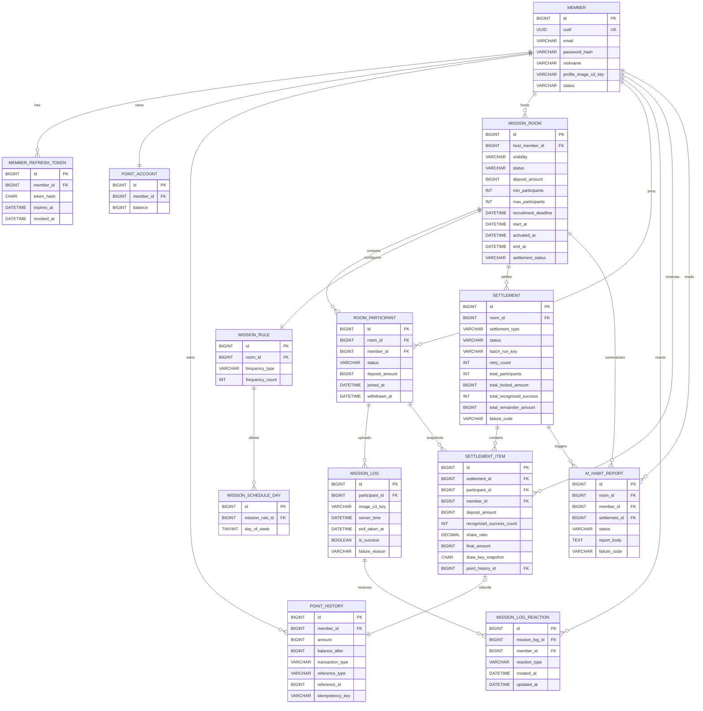

# ERD 초안: 갓세이빙 MVP

기준 문서:

- [PRD-god-saving.md](./PRD-god-saving.md)
- [Settlement-design.md](./Settlement-design.md)

## 1. ERD 설계 원칙

### 1.1 Aggregate / 도메인 경계

- `member`는 계정과 인증의 주체다. 포인트 잔액과 원장은 모두 `member`를 기준으로 연결한다.
- `mission_room`은 크루 모집과 진행의 루트 aggregate다. `room_participant`, `mission_rule`, `mission_schedule_day`가 여기에 소속된다.
- `mission_log`는 `room_participant`의 인증 기록이다. `Settlement.status = SUCCEEDED` 전 계산 입력으로 이 로그와 참여자 상태를 다시 읽는다.
- `settlement`는 `mission_room` 종료 이후의 정산 aggregate다. `settlement_item`은 참여자별 계산 스냅샷을 가지며, 성공 정산 이후 운영/분쟁/조회 기준이 된다.
- `point_history`는 포인트 원장 aggregate이자 금액 source of truth다. 사용 가능 잔액의 증감과 보증금 잠금/환급 반영을 기록하고, `point_account.balance`는 이 원장에서 재계산 가능한 캐시로 둔다.
- `total_locked_amount` 같은 정산 집계 스냅샷은 `point_account`나 `point_history` 재합산이 아니라 `room_participant.deposit_amount` 기준으로 고정한다.

### 1.2 정산 원천 데이터

- `Settlement.status = SUCCEEDED` 전 정산 계산 입력은 `mission_log`, `room_participant`, `mission_room`, `mission_rule`, `mission_schedule_day`다.
- `settlement`와 `settlement_item`은 원천 로그를 다시 계산한 결과와 근거를 남기는 스냅샷이다.
- `Settlement.status = SUCCEEDED` 이후 운영/분쟁/조회 기준은 `settlement_item`과 연결된 `point_history`다. 이후 `MissionLog` 재계산은 감사/디버깅 검증용이지 지급 결과를 대체하는 기준이 아니다.
- 실시간 지분율, 통계성 캐시, `point_account.balance`는 source of truth가 아니다. 필요해도 정산 계산이나 분쟁 판단의 최종 기준으로 쓰지 않는다.

### 1.3 논리 삭제 정책

- `room_participant`는 물리 삭제하지 않고 `JOINED`, `WITHDRAWN` 상태로만 관리한다.
- `mission_log`, `settlement`, `settlement_item`, `point_history`는 감사 추적을 위해 append-only에 가깝게 다룬다.
- `mission_room.settlement_status`는 필요 시 조회 최적화용 비정규화 필드로 둘 수 있지만, 원천 상태는 항상 `settlement.status`다.

### 1.4 Unique 제약 원칙

- 사용자 참여 불변식은 DB에서 강제한다. 핵심 제약은 `unique(room_id, member_id)`다.
- 정산 헤더 중복 생성은 `unique(room_id, settlement_type)`로 막는다.
- 정산 아이템 중복 생성은 `unique(settlement_id, participant_id)`로 막는다.
- 포인트 중복 반영은 `unique(point_history.idempotency_key)`로 막는다.
- 분산 락은 보조 수단이고, 최종 방어선은 DB unique와 조건부 update다.

## 2. 테이블 목록 요약

### 2.1 Core

| 테이블명               | 역할                                | 핵심 관계                                                                 |
| ---------------------- | ----------------------------------- | ------------------------------------------------------------------------- |
| `member`               | 사용자 계정의 기준 엔티티           | `member 1:N room_participant`, `member 1:1 point_account`                 |
| `member_refresh_token` | JWT refresh token 저장              | `member 1:N member_refresh_token`                                         |
| `point_account`        | 현재 사용 가능 포인트 잔액          | `member 1:1 point_account`                                                |
| `point_history`        | 포인트 증감과 보증금 잠금/환급 원장 | `member 1:N point_history`, `settlement_item 0..1:1 point_history`        |
| `mission_room`         | 크루 모집, 진행, 종료 단위          | `member 1:N mission_room(host)`, `mission_room 1:N room_participant`      |
| `room_participant`     | 방 참여 단위이자 보증금 잠금 단위   | `mission_room 1:N room_participant`, `room_participant 1:N mission_log`   |
| `mission_rule`         | 인증 주기 규칙                      | `mission_room 1:1 mission_rule`                                           |
| `mission_schedule_day` | `SPECIFIC_DAYS` 요일 규칙           | `mission_rule 1:N mission_schedule_day`                                   |
| `mission_log`          | 미션 인증 원본 로그                 | `room_participant 1:N mission_log`                                        |
| `mission_log_reaction` | 인증 성공 피드 리액션               | `mission_log 1:N mission_log_reaction`, `member 1:N mission_log_reaction` |
| `settlement`           | 방 종료 후 정산 헤더                | `mission_room 1:N settlement`                                             |
| `settlement_item`      | 참여자별 정산 스냅샷과 결과         | `settlement 1:N settlement_item`, `room_participant 1:N settlement_item`  |

### 2.2 First-release Non-transactional / Deferred

| 테이블명          | 역할                            | 포함 판단                                                             |
| ----------------- | ------------------------------- | --------------------------------------------------------------------- |
| `ai_habit_report` | 정산 이후 개인 회고 리포트 저장 | 첫 릴리스 필수. 단, 정산/환급/포인트 원장 source of truth는 아니다    |
| 알림 전용 테이블  | SSE, 이메일 발송 이력 영속화    | MVP core에서는 제외한다. 이메일은 SMTP 발송 structured log, bounded retry, 운영자 수동 재발송으로 시작한다. 비즈니스 필수 고지로 격상되면 notification log/outbox를 별도 ADR로 재검토한다 |

## 3. 테이블 상세

### `member`

역할:

- 실제 사용자 계정을 식별한다.
- 내부 persistence identity와 외부 canonical identifier를 분리한다.
- 로그인 식별자와 canonical identity를 분리한다.

주요 컬럼:

| 컬럼                   | 타입 제안      | nullable | 설명                              |
| ---------------------- | -------------- | -------- | --------------------------------- |
| `id`                   | `BIGINT`       | N        | 회원 PK. DB 내부 FK / join 기준   |
| `uuid`                 | `BINARY(16)` 또는 `CHAR(36)` | N | immutable external canonical identifier |
| `email`                | `VARCHAR(255)` | N        | 로그인 식별자 및 연락처 |
| `password_hash`        | `VARCHAR(255)` | Y        | 일반 로그인 사용 시 비밀번호 해시 |
| `nickname`             | `VARCHAR(50)`  | N        | 노출 이름                         |
| `profile_image_s3_key` | `VARCHAR(255)` | Y        | 프로필 이미지 S3 key              |
| `status`               | `VARCHAR(20)`  | N        | 계정 상태                         |
| `created_at`           | `DATETIME(6)`  | N        | 생성 시각                         |
| `updated_at`           | `DATETIME(6)`  | N        | 수정 시각                         |

PK:

- `id`

FK:

- 없음

Unique / Index:

- `unique(uuid)`
- `unique(email)`
- `index(status)`

상태값 / Enum:

- `status`: `ACTIVE`, `DEACTIVATED`

주의사항:

- `member.id`는 내부 persistence identity이고 외부 사용자 식별자로 노출하지 않는다.
- `member.uuid`는 회원 생성 시 발급하고 변경하지 않는 immutable external canonical identifier다.
- `email`은 변경 가능하고 PII이므로 canonical identity로 사용하지 않는다.
- JWT와 SSE를 포함한 외부 계약에서 이 identifier를 사용하는 방식은 `API-spec-god-saving.md`가 소유한다.
- `member`는 계정의 기준 키고, 정산 계산 단위는 아니다.
- `member`는 사용자 식별·인증·프로필 상태를 담당하며, 포인트 현재 잔액처럼 빈번히 변하는 금액 상태는 직접 보관하지 않는다.
- 프로필은 닉네임 + 프로필 이미지로 제한된다.
- 별도의 social profile 테이블은 도입하지 않는다.
- 프로필 수정은 인증/JWT, 크루 참여, 포인트 원장, 정산, 환급, 상태 생명주기에 side effect를 만들지 않는다.
- 정산 지급과 원장 기록은 항상 내부 FK인 `member_id -> member.id` 기준으로 연결한다.
- MVP에서는 이메일/비밀번호 기반 가입만 지원하며, SMS 인증·이메일 인증·KYC 같은 별도 verification 상태는 도입하지 않는다.

### `member_refresh_token`

역할:

- JWT refresh token의 서버 저장소 역할을 한다.
- 로그아웃, 강제 만료, 다중 기기 세션 제어를 위한 최소 auth 테이블이다.

주요 컬럼:

| 컬럼         | 타입 제안     | nullable | 설명               |
| ------------ | ------------- | -------- | ------------------ |
| `id`         | `BIGINT`      | N        | 토큰 PK            |
| `member_id`  | `BIGINT`      | N        | 회원 FK            |
| `token_hash` | `CHAR(64)`    | N        | refresh token 해시 |
| `expires_at` | `DATETIME(6)` | N        | 만료 시각          |
| `revoked_at` | `DATETIME(6)` | Y        | 폐기 시각          |
| `created_at` | `DATETIME(6)` | N        | 생성 시각          |

PK:

- `id`

FK:

- `member_id -> member.id`

Unique / Index:

- `unique(token_hash)`
- `index(member_id, expires_at)`

상태값 / Enum:

- 별도 enum 없음

주의사항:

- raw token이 아니라 해시만 저장한다.
- MVP에서는 access token blacklist보다 refresh token revoke 관리가 우선이다.

### `point_account`

역할:

- 현재 사용 가능한 포인트 잔액을 빠르게 조회하기 위한 현재값 캐시 테이블이다.
- `point_account`를 `member`와 분리하는 이유는 사용자 식별·인증 정보와 포인트 잔액 갱신 책임을 분리하기 위해서다.
- 실제 포인트 source of truth는 `point_history`이며, `balance`는 `point_history`에서 재계산 가능한 캐시다.
- 보증금은 별도 계좌로 이동하지 않고, `balance`에서 차감된 뒤 `room_participant.deposit_amount`로 잠긴 상태를 표현한다.

주요 컬럼:

| 컬럼         | 타입 제안     | nullable | 설명                |
| ------------ | ------------- | -------- | ------------------- |
| `id`         | `BIGINT`      | N        | 계정 PK             |
| `member_id`  | `BIGINT`      | N        | 회원 FK             |
| `balance`    | `BIGINT`      | N        | 현재 사용 가능 잔액 |
| `created_at` | `DATETIME(6)` | N        | 생성 시각           |
| `updated_at` | `DATETIME(6)` | N        | 수정 시각           |

PK:

- `id`

FK:

- `member_id -> member.id`

Unique / Index:

- `unique(member_id)`

상태값 / Enum:

- 없음

주의사항:

- `ROOM_DEPOSIT_LOCK`가 발생하면 별도 자산 이동 없이 `balance`가 차감된다.
- 차감된 금액은 해당 `room_participant.deposit_amount`에 participant 단위 잠금 금액으로 기록된다.
- MVP에서 `point_account`의 현재값 컬럼은 현재 사용 가능 잔액 캐시인 `balance` 하나만 두며, `pending_balance`, `waiting_balance`, `locked_balance`, `available_balance` 같은 별도 현재값 컬럼은 두지 않는다.
- 사용자별 묶인 금액은 `point_account`에 저장하지 않고, `room_participant.deposit_amount`와 `mission_room.status`를 이용해 API projection으로 계산한다.
- MVP 기준 `GET /api/points.locked_balance` projection은 양수 `room_participant.deposit_amount`를 가진 참여 건 중 `mission_room.status IN ('RECRUITING', 'ACTIVE', 'CLOSED')`인 방의 합계로 시작한다.
- `WITHDRAWN` 참여자도 정산 완료 전까지는 즉시 환급되지 않으므로 projection 합계에 포함된다.
- 이 projection은 정산 전 UX 표시용이며 현재 환급 가능 금액, 출금 가능 여부, 분쟁 처리, 정산 결과 판단 기준이 아니다.
- 보증금 잠금 차감은 `WHERE balance >= deposit_amount` 조건을 포함한 조건부 update로 수행하고, row count가 `1`일 때만 성공으로 간주한다.
- 보증금 잠금 처리, `room_participant` 생성, `ROOM_DEPOSIT_LOCK point_history` 기록은 반드시 하나의 트랜잭션으로 처리한다.
- 권장 순서는 `point_account.balance` 조건부 차감 -> `room_participant` 생성 및 `deposit_amount` 반영 -> `ROOM_DEPOSIT_LOCK point_history` 생성이다.
- 위 세 단계 중 하나라도 실패하면 전체 롤백한다.
- `Settlement.total_locked_amount`는 정산 실행 시점의 정산 대상 participant `room_participant.deposit_amount` 합계로 스냅샷을 고정한다.
- `point_history` insert와 `point_account.balance` 갱신은 같은 트랜잭션에서 처리한다.
- `point_account.balance`와 `point_history` 재계산값이 불일치하면 `point_history`를 기준으로 원인을 조사하고 캐시를 보정한다.
- `point_history`는 금액 이벤트 원장이며, 현재 묶인 금액 조회의 source로 재합산하지 않는다.

### `point_history`

역할:

- 모든 포인트 증감의 유일한 원장이자 금액 source of truth다.
- 정산 재시도 시 중복 지급을 막는 deterministic 멱등성 키를 보관한다.
- 보증금 잠금과 환급 모두 이 테이블에 이벤트로 남긴다.

주요 컬럼:

| 컬럼               | 타입 제안      | nullable | 설명               |
| ------------------ | -------------- | -------- | ------------------ |
| `id`               | `BIGINT`       | N        | 원장 PK            |
| `member_id`        | `BIGINT`       | N        | 사용자 계정 FK     |
| `amount`           | `BIGINT`       | N        | 증감 금액          |
| `balance_after`    | `BIGINT`       | N        | 반영 후 잔액       |
| `transaction_type` | `VARCHAR(40)`  | N        | 포인트 이벤트 종류 |
| `reference_type`   | `VARCHAR(40)`  | N        | 참조 엔티티 종류   |
| `reference_id`     | `BIGINT`       | N        | 참조 엔티티 PK     |
| `idempotency_key`  | `VARCHAR(255)` | N        | 중복 반영 방지 키  |
| `created_at`       | `DATETIME(6)`  | N        | 생성 시각          |

PK:

- `id`

FK:

- `member_id -> member.id`

Unique / Index:

- `unique(idempotency_key)`
- `index(member_id, created_at)`
- `index(reference_type, reference_id)`

상태값 / Enum:

- `transaction_type`: `POINT_CHARGE`, `ROOM_DEPOSIT_LOCK`, `ROOM_SETTLEMENT_REFUND`, `ROOM_CANCELLED_REFUND`
- `reference_type`: `POINT_CHARGE`, `ROOM_PARTICIPANT`, `SETTLEMENT_ITEM`

`reference_type` / `reference_id` 매핑:

| 도메인 동작         | `transaction_type`       | `reference_type`   | `reference_id` 규칙                                                                                                 |
| ------------------- | ------------------------ | ------------------ | ------------------------------------------------------------------------------------------------------------------- |
| 포인트 충전         | `POINT_CHARGE`           | `POINT_CHARGE`     | MVP에서는 생성된 `point_history.id`를 사용한다. API의 `payment_id`에 담긴 Toss `paymentKey`는 `idempotency_key = charge:{paymentKey}`에 남긴다. |
| 방 참여 보증금 잠금 | `ROOM_DEPOSIT_LOCK`      | `ROOM_PARTICIPANT` | `room_participant.id`                                                                                               |
| 일반 정산 환급      | `ROOM_SETTLEMENT_REFUND` | `SETTLEMENT_ITEM`  | `settlement_item.id`                                                                                                |
| 시작 전 취소 환급   | `ROOM_CANCELLED_REFUND`  | `SETTLEMENT_ITEM`  | `settlement_item.id`                                                                                                |

주의사항:

- 모든 포인트 변경은 항상 `member_id` 기준으로 기록한다.
- `POINT_CHARGE`는 포인트 충전으로 `balance`를 증가시키는 이벤트다.
- `ROOM_DEPOSIT_LOCK`는 자산 이동이 아니라 기존 포인트를 사용 불가 상태로 전환하는 이벤트이며 `balance`를 감소시킨다.
- `ROOM_SETTLEMENT_REFUND`는 일반 정산 환급으로 `balance`를 증가시킨다.
- `ROOM_CANCELLED_REFUND`는 취소형 정산 환급으로 `balance`를 증가시킨다.
- 포인트 충전은 `reference_type = POINT_CHARGE`, `reference_id = point_history.id`로 추적하고, API의 `payment_id`에 담긴 Toss `paymentKey`는 `idempotency_key = charge:{paymentKey}`에 남긴다. `orderId`는 confirm 검증과 로그 상관관계 추적용이며 idempotency key 구성값으로 사용하지 않는다.
- MVP에서는 별도 payment aggregate 없이 `point_history` 자체를 충전 ledger로 사용하므로, 충전 이벤트의 `reference_id`는 생성된 자기 `point_history.id`를 가리킨다.
- 참여 시 보증금 잠금은 `reference_type = ROOM_PARTICIPANT`, `reference_id = room_participant.id`로 추적한다.
- 정산 지급의 `reference_type = SETTLEMENT_ITEM`, `reference_id = settlement_item.id` 조합으로 어느 계산 결과가 원장에 반영됐는지 추적한다.
- 모든 포인트 변경은 `idempotency_key`를 반드시 가진다.
- 동일 이벤트는 항상 동일한 `idempotency_key`를 사용하고, `settlement.id` 같은 런타임 값에 의존하지 않는다.
- 동일 `idempotency_key`가 동일 payload로 다시 들어오면 기존 `point_history`를 재사용하거나 연결하고, 동일 키에 다른 payload가 들어오면 idempotency conflict로 처리한다.
- 이벤트별 고정 규칙 예시는 아래와 같다.
  - 포인트 충전: `charge:{paymentKey}`
  - 보증금 잠금: `deposit:room:{roomId}:participant:{participantId}`
  - 일반 정산 환급: `settlement:room:{roomId}:type:{settlementType}:participant:{participantId}:refund`
  - 취소형 정산 환급: `settlement:room:{roomId}:type:{settlementType}:participant:{participantId}:cancel_refund`

### `mission_room`

역할:

- 크루 모집과 미션 진행의 루트 엔티티다.
- 참여 정책, 기간, 공개 여부, 정산 대상 방 상태를 가진다.

주요 컬럼:

| 컬럼                   | 타입 제안      | nullable | 설명                                      |
| ---------------------- | -------------- | -------- | ----------------------------------------- |
| `id`                   | `BIGINT`       | N        | 방 PK                                     |
| `host_member_id`       | `BIGINT`       | N        | 방 생성자 FK                              |
| `title`                | `VARCHAR(100)` | N        | 크루 제목                                 |
| `description`          | `TEXT`         | Y        | 크루 설명                                 |
| `visibility`           | `VARCHAR(20)`  | N        | 공개/비공개                               |
| `join_code`            | `CHAR(6)`      | Y        | 비공개 참여 코드                          |
| `status`               | `VARCHAR(20)`  | N        | 방 상태                                   |
| `deposit_amount`       | `BIGINT`       | N        | 방 기본 보증금                            |
| `min_participants`     | `INT`          | N        | 시작 command 시점에 재검증하는 최소 인원 |
| `max_participants`     | `INT`          | N        | 최대 참여 인원                            |
| `recruitment_deadline` | `DATETIME(6)`  | N        | 신규 참여 마감 시각                       |
| `start_at`             | `DATETIME(6)`  | N        | 예정 시작 시각 / MVP 수동 시작 가능 만료 |
| `activated_at`         | `DATETIME(6)`  | Y        | 실제 ACTIVE 전이 시각                     |
| `end_at`               | `DATETIME(6)`  | N        | 계획된 미션 종료 cutoff                   |
| `settlement_status`    | `VARCHAR(20)`  | Y        | 조회 최적화용 비정규화 필드               |
| `created_at`        | `DATETIME(6)`  | N        | 생성 시각                   |
| `updated_at`        | `DATETIME(6)`  | N        | 수정 시각                   |

PK:

- `id`

FK:

- `host_member_id -> member.id`

Unique / Index:

- `unique(join_code)`
- `index(host_member_id, created_at)`
- `index(status, recruitment_deadline)`
- `index(status, start_at, end_at)`
- `index(status, activated_at)`
- `check(min_participants >= 2 and min_participants <= max_participants and max_participants <= 10)`

상태값 / Enum:

- `visibility`: `PUBLIC`, `PRIVATE`
- `status`: `RECRUITING`, `ACTIVE`, `CLOSED`, `CANCELLED`
- `settlement_status`: `NONE`, `PENDING`, `RUNNING`, `SUCCEEDED`, `FAILED`, `RETRY_WAIT`

주의사항:

- 신규 참여는 `RECRUITING` 상태이면서 서버 시간이 `recruitment_deadline` 전일 때만 허용한다.
- `min_participants` 기본값은 `2`고, `2 <= min_participants <= max_participants <= 10`을 만족해야 한다. 이는 자동 시작 트리거가 아니라 `StartRoom` command 시점의 precondition이다.
- `start_at`은 예정 시작 시각이자 MVP에서 수동 시작 가능 만료 시각이다. 실제 lifecycle/정산/log/projection anchor는 `activated_at`이다.
- `activated_at`은 `StartRoom` 성공 전까지 `NULL`이며, `ACTIVE`/`CLOSED` 방에서는 실제 ACTIVE 전이 시각이어야 한다.
- `end_at`은 계획된 미션 종료 cutoff이며 activation 지연으로 자동 이동하지 않는다.
- `settlement_status`는 있더라도 조회 최적화용이다. 정산 처리 원천 상태는 `settlement.status`다.
- `deposit_amount`는 방 규칙의 기본 보증금이고, 실제 정산 원천 금액은 `room_participant.deposit_amount`를 사용한다.

### `room_participant`

역할:

- 특정 방에 참여한 단위를 나타낸다.
- 정산 계산의 기준 단위는 `participant_id`, 즉 이 테이블의 PK다.
- 보증금 잠금 금액도 participant 단위로 이 테이블에서 관리한다.

주요 컬럼:

| 컬럼             | 타입 제안     | nullable | 설명                         |
| ---------------- | ------------- | -------- | ---------------------------- |
| `id`             | `BIGINT`      | N        | 참여 PK                      |
| `room_id`        | `BIGINT`      | N        | 방 FK                        |
| `member_id`      | `BIGINT`      | N        | 회원 FK                      |
| `status`         | `VARCHAR(20)` | N        | 참여 상태                    |
| `deposit_amount` | `BIGINT`      | N        | 해당 방에서 잠긴 보증금 금액 |
| `joined_at`      | `DATETIME(6)` | N        | 참여 시각                    |
| `withdrawn_at`   | `DATETIME(6)` | Y        | 탈퇴 시각                    |
| `created_at`     | `DATETIME(6)` | N        | 생성 시각                    |
| `updated_at`     | `DATETIME(6)` | N        | 수정 시각                    |

PK:

- `id`

FK:

- `room_id -> mission_room.id`
- `member_id -> member.id`

Unique / Index:

- `unique(room_id, member_id)`
- `index(room_id, status)`
- `index(member_id, status)`

상태값 / Enum:

- `status`: `JOINED`, `WITHDRAWN`

주의사항:

- 한 `member`는 같은 `mission_room`에 하나의 `room_participant`만 가진다.
- 탈퇴 후 재참여는 MVP에서 지원하지 않는다. 기존 row를 물리 삭제하거나 재사용하지 않는다.
- 보증금은 별도 계좌로 이동하지 않으며, `point_account.balance`에서 차감되어 `room_participant.deposit_amount`로 잠긴 상태로 관리된다.
- `deposit_amount`는 participant 단위 잠금 금액의 source of truth다. 기본적으로 `mission_room.deposit_amount`를 복사해 저장한다.
- 참여 처리에서는 보증금 잠금, `room_participant` 생성, `ROOM_DEPOSIT_LOCK point_history` 기록이 하나의 트랜잭션으로 함께 성공하거나 함께 롤백되어야 한다.

### `mission_rule`

역할:

- 방의 인증 주기 규칙을 정의한다.
- `DAILY`, `SPECIFIC_DAYS`, `WEEKLY_N` 중 하나를 가진다.

주요 컬럼:

| 컬럼              | 타입 제안     | nullable | 설명                          |
| ----------------- | ------------- | -------- | ----------------------------- |
| `id`              | `BIGINT`      | N        | 규칙 PK                       |
| `room_id`         | `BIGINT`      | N        | 방 FK                         |
| `frequency_type`  | `VARCHAR(20)` | N        | 인증 주기 타입                |
| `frequency_count` | `INT`         | Y        | `WEEKLY_N`에서 주당 인정 횟수 |
| `created_at`      | `DATETIME(6)` | N        | 생성 시각                     |
| `updated_at`      | `DATETIME(6)` | N        | 수정 시각                     |

PK:

- `id`

FK:

- `room_id -> mission_room.id`

Unique / Index:

- `unique(room_id)`

상태값 / Enum:

- `frequency_type`: `DAILY`, `SPECIFIC_DAYS`, `WEEKLY_N`

주의사항:

- `DAILY`는 하루 최대 1회 인정 규칙을 애플리케이션 계산으로 처리한다.
- `SPECIFIC_DAYS`는 특정 날짜가 아니라 반복 요일 규칙이며, 허용 요일 목록을 `mission_schedule_day`에서 읽는다.
- `WEEKLY_N`는 `frequency_count`가 필수다.

### `mission_schedule_day`

역할:

- `SPECIFIC_DAYS` 미션의 허용 요일을 저장한다.
- 요일 규칙을 별도 row로 저장해 정산 재계산과 API 검증에서 같은 원본을 사용한다.

주요 컬럼:

| 컬럼              | 타입 제안     | nullable | 설명                  |
| ----------------- | ------------- | -------- | --------------------- |
| `id`              | `BIGINT`      | N        | 스케줄 PK             |
| `mission_rule_id` | `BIGINT`      | N        | 규칙 FK               |
| `day_of_week`     | `TINYINT`     | N        | 1=MONDAY ... 7=SUNDAY |
| `created_at`      | `DATETIME(6)` | N        | 생성 시각             |

PK:

- `id`

FK:

- `mission_rule_id -> mission_rule.id`

Unique / Index:

- `unique(mission_rule_id, day_of_week)`

상태값 / Enum:

- 별도 enum 없음

주의사항:

- 이 테이블은 `frequency_type = SPECIFIC_DAYS`일 때만 사용한다.
- `SPECIFIC_DAYS`는 특정 날짜 테이블이 아니라 반복 요일 테이블로 고정한다.

### `mission_log`

역할:

- 인증 업로드의 원본 로그를 저장한다.
- 최종 정산 재계산의 직접 입력값이다.

주요 컬럼:

| 컬럼             | 타입 제안      | nullable | 설명                  |
| ---------------- | -------------- | -------- | --------------------- |
| `id`             | `BIGINT`       | N        | 로그 PK               |
| `participant_id` | `BIGINT`       | N        | 참여 FK               |
| `image_url`      | `VARCHAR(500)` | Y        | 조회용 이미지 URL     |
| `image_s3_key`   | `VARCHAR(255)` | N        | 저장소 키             |
| `server_time`    | `DATETIME(6)`  | N        | 서버 수신 시각        |
| `exif_taken_at`  | `DATETIME(6)`  | Y        | 서버가 S3 object에서 추출/검증한 이미지 Exif 촬영 시각 |
| `is_success`     | `TINYINT(1)`   | N        | 성공 여부             |
| `failure_reason` | `VARCHAR(50)`  | Y        | 실패 사유 코드        |
| `created_at`     | `DATETIME(6)`  | N        | 생성 시각             |

PK:

- `id`

FK:

- `participant_id -> room_participant.id`

Unique / Index:

- `index(participant_id, server_time)`
- `index(participant_id, is_success, server_time)`

상태값 / Enum:

- `failure_reason`: `EXIF_MISSING`, `EXIF_TIME_INVALID`, `BEFORE_START`, `AFTER_END`, `AFTER_WITHDRAWN`

주의사항:

- `participant_id` 기준으로만 기록한다. 방과 회원은 참여 엔티티를 통해 역추적한다.
- `exif_taken_at`은 클라이언트가 제출한 값을 신뢰해 저장하는 컬럼이 아니다. 서버가 S3에 업로드된 object에서 EXIF를 추출/검증한 결과를 저장한다.
- EXIF가 없거나 유효하지 않으면 `failure_reason`은 `EXIF_MISSING` 또는 `EXIF_TIME_INVALID`가 된다.
- 정산 인정 횟수 계산 기준 시간은 `exif_taken_at`이 아니라 `server_time`이다.
- `withdrawn_at` 이후 인증 차단은 API에서 한 번, 정산 시 `server_time < withdrawn_at` 필터로 한 번 더 적용한다.
- `DAILY` 중복, `SPECIFIC_DAYS` 제외, `WEEKLY_N` 상한 제외 같은 최종 인정 제외 근거는 `mission_log.failure_reason`이 아니라 `settlement_item.calculation_reason`에 남긴다.
- 실시간 성공 여부와 최종 인정 횟수는 다를 수 있으므로, 최종 결과는 `settlement_item`에서 설명한다.

### `mission_log_reaction`

역할:

- 인증 성공 피드 게시물에 대한 회원별 리액션을 저장한다.
- 소셜 메타데이터 전용 테이블이며 정산, 포인트, 환급, AI, 상태 생명주기의 입력값이 아니다.

주요 컬럼:

| 컬럼             | 타입 제안     | nullable | 설명                |
| ---------------- | ------------- | -------- | ------------------- |
| `id`             | `BIGINT`      | N        | 리액션 PK           |
| `mission_log_id` | `BIGINT`      | N        | 인증 로그 FK        |
| `member_id`      | `BIGINT`      | N        | 리액션 작성 회원 FK |
| `reaction_type`  | `VARCHAR(20)` | N        | 리액션 종류         |
| `created_at`     | `DATETIME(6)` | N        | 생성 시각           |
| `updated_at`     | `DATETIME(6)` | N        | 수정 시각           |

PK:

- `id`

FK:

- `mission_log_id -> mission_log.id`
- `member_id -> member.id`

Unique / Index:

- `unique(mission_log_id, member_id)`
- `index(mission_log_id)`
- `index(member_id, created_at)`

상태값 / Enum:

- `reaction_type`: `CHEER`, `CLAP`, `FIRE`

주의사항:

- 리액션은 `mission_log.is_success = true`인 feed-eligible 로그에만 허용한다. 이 제약은 API/애플리케이션 계층에서 검증한다.
- 한 회원은 한 `mission_log`에 하나의 리액션만 가진다. `POST`는 같은 unique key를 기준으로 멱등 upsert하고, `DELETE /me`는 멱등 delete한다.
- 리액션 수는 이 테이블에서 파생 계산한다. `mission_log`에 `reaction_count` 같은 저장 카운터를 추가하지 않는다.
- 리액션 생성, 수정, 삭제는 `mission_log.is_success`, `failure_reason`, 이미지, 서버 시간 등 원본 로그를 변경하지 않는다.
- 리액션은 `settlement`, `settlement_item`, `point_history`, 환급 상태, AI 리포트, `MissionRoom.status`, `Participant.status`, `Settlement.status`를 생성하거나 수정하거나 롤백하지 않는다.
- 이 패치에서 추가하는 피드 관련 영속성은 `mission_log_reaction`뿐이다. feed status 테이블/컬럼은 두지 않는다.

### `settlement`

역할:

- 방 종료 또는 취소 이후 생성되는 정산 헤더다.
- 배치 claim, 재시도, 실패 코드, 집계 금액의 원천 엔티티다.

주요 컬럼:

| 컬럼                              | 타입 제안      | nullable | 설명                            |
| --------------------------------- | -------------- | -------- | ------------------------------- |
| `id`                              | `BIGINT`       | N        | 정산 PK                         |
| `room_id`                         | `BIGINT`       | N        | 대상 방 FK                      |
| `settlement_type`                 | `VARCHAR(30)`  | N        | 정산 종류                       |
| `status`                          | `VARCHAR(20)`  | N        | 정산 상태                       |
| `batch_run_key`                   | `VARCHAR(100)` | Y        | 배치 실행 식별자                |
| `retry_count`                     | `INT`          | N        | 누적 재시도 횟수                |
| `total_participants`              | `INT`          | N        | 정산 대상 participant 수        |
| `total_locked_amount`             | `BIGINT`       | N        | 정산 시점 총 잠긴 보증금 스냅샷 |
| `total_recognized_success`        | `INT`          | N        | 전체 인정 성공 횟수             |
| `total_base_refund_amount`        | `BIGINT`       | N        | 절사 합계                       |
| `total_remainder_amount`          | `BIGINT`       | N        | 잔액 합계                       |
| `remainder_policy`                | `VARCHAR(30)`  | N        | 잔액 분배 방식                  |
| `remainder_winner_participant_id` | `BIGINT`       | Y        | 일반 정산 잔액 귀속 대상        |
| `failure_code`                    | `VARCHAR(50)`  | Y        | 실패 코드                       |
| `failure_message`                 | `VARCHAR(500)` | Y        | 최근 실패 요약                  |
| `started_at`                      | `DATETIME(6)`  | Y        | 실행 시작 시각                  |
| `finished_at`                     | `DATETIME(6)`  | Y        | 실행 종료 시각                  |
| `created_at`                      | `DATETIME(6)`  | N        | 생성 시각                       |
| `updated_at`                      | `DATETIME(6)`  | N        | 수정 시각                       |

PK:

- `id`

FK:

- `room_id -> mission_room.id`
- `remainder_winner_participant_id -> room_participant.id`

Unique / Index:

- `unique(room_id, settlement_type)`
- `index(status, retry_count, created_at)`

상태값 / Enum:

- `settlement_type`: `NORMAL`, `CANCELLED_BEFORE_START`
- `status`: `PENDING`, `RUNNING`, `SUCCEEDED`, `FAILED`, `RETRY_WAIT`
- `remainder_policy`: `TOP_1_ALL`, `DRAW_SPLIT_ONE_WON`
- `failure_code`: `INPUT_LOAD_FAILED`, `CALCULATION_FAILED`, `POINT_CREDIT_FAILED`, `DUPLICATE_SETTLEMENT`, `LOCK_ACQUIRE_FAILED`, `UNKNOWN`

주의사항:

- `Settlement(PENDING)`는 종료/취소 감지 시 선생성하며, 아직 워커가 claim하지 않은 실행 전 상태다.
- `Settlement.status`가 정산 상태의 원천이고, `mission_room.settlement_status`는 projection이다.
- 같은 방의 같은 `settlement_type`은 하나만 허용한다.
- `total_participants`는 `종료 시점까지 locked deposit이 존재하는 모든 participant 수`다. `WITHDRAWN` 참여자도 locked deposit이 남아 있으면 포함한다.
- `total_locked_amount`는 정산 실행 시점에 정산 대상 participant `room_participant.deposit_amount` 합계를 스냅샷으로 고정한 값이다.
- `total_locked_amount`는 `point_history`나 `point_account`를 다시 합산해 계산하지 않는다.
- 일반 정산에서 절사 후 남은 잔액은 기여도 1위 참여자에게 지급한다. 기여도 1위가 동점인 경우 성공 횟수를 비교하고, 그래도 동일하면 재현 가능한 draw 규칙으로 1명을 결정한다.
- 일부 participant 지급만 완료된 partial 상태는 `RETRY_WAIT` 또는 `FAILED`로 남으며, 모든 `settlement_item.point_history_id` 연결과 대응 `point_history` 존재가 검증된 경우에만 `SUCCEEDED`가 된다.
- MVP에서는 별도 `total_active_participants` 컬럼을 두지 않는다.

### `settlement_item`

역할:

- 참여자별 정산 입력 스냅샷과 결과를 저장한다.
- 왜 이 금액이 나왔는지 나중에도 설명할 수 있게 만든다.

주요 컬럼:

| 컬럼                          | 타입 제안       | nullable | 설명                    |
| ----------------------------- | --------------- | -------- | ----------------------- |
| `id`                          | `BIGINT`        | N        | 아이템 PK               |
| `settlement_id`               | `BIGINT`        | N        | 정산 FK                 |
| `participant_id`              | `BIGINT`        | N        | 참여 FK                 |
| `member_id`                   | `BIGINT`        | N        | 지급 대상 회원 FK       |
| `participant_status_snapshot` | `VARCHAR(20)`   | N        | 참여 상태 스냅샷        |
| `deposit_amount`              | `BIGINT`        | N        | 잠긴 보증금 스냅샷      |
| `success_count_raw`           | `INT`           | N        | 원시 성공 로그 수       |
| `recognized_success_count`    | `INT`           | N        | 인정 성공 횟수          |
| `recognized_dates_count`      | `INT`           | N        | 인정 날짜 수            |
| `excluded_success_count`      | `INT`           | N        | 제외된 성공 수          |
| `period_start_at`             | `DATETIME(6)`   | N        | 계산 시작               |
| `period_end_at`               | `DATETIME(6)`   | N        | 계산 종료               |
| `withdrawn_at_snapshot`       | `DATETIME(6)`   | Y        | 탈퇴 시각 스냅샷        |
| `share_ratio`                 | `DECIMAL(18,8)` | N        | 지분율                  |
| `raw_refund_amount`           | `DECIMAL(18,2)` | N        | 절사 전 금액            |
| `base_refund_amount`          | `BIGINT`        | N        | 절사 금액               |
| `remainder_bonus_amount`      | `BIGINT`        | N        | 잔액 가산분             |
| `reward_amount`               | `BIGINT`        | N        | 잠긴 보증금 초과 환급분 |
| `refund_amount`               | `BIGINT`        | N        | 실제 환급 총액          |
| `final_amount`                | `BIGINT`        | N        | 최종 지급 금액          |
| `draw_key_snapshot`           | `CHAR(64)`      | Y        | tie-break 키            |
| `tie_break_rank`              | `INT`           | Y        | draw 순위               |
| `calculation_reason`          | `JSON`          | N        | 포함/제외 근거          |
| `point_history_id`            | `BIGINT`        | Y        | 환급 원장 FK            |
| `created_at`                  | `DATETIME(6)`   | N        | 생성 시각               |

PK:

- `id`

FK:

- `settlement_id -> settlement.id`
- `participant_id -> room_participant.id`
- `member_id -> member.id`
- `point_history_id -> point_history.id`

Unique / Index:

- `unique(settlement_id, participant_id)`
- `unique(point_history_id)`
- `index(member_id)`

상태값 / Enum:

- `participant_status_snapshot`: `JOINED`, `WITHDRAWN`
- `calculation_reason` vocabulary는 JSON 내부 진단 코드 문자열이며 DB enum/constraint나 public API enum이 아니다. MVP discoverability 목적의 대표 값은 `DAILY_DUPLICATE`, `INVALID_SCHEDULE_DAY`, `WEEKLY_N_OVERFLOW`, `AFTER_WITHDRAWN_AT`, `BEFORE_START`, `AFTER_END`다.

주의사항:

- 정산 계산 단위는 `participant_id`고, 실제 포인트 지급 단위는 `member_id`다.
- 같은 방에서 한 `member`가 하나의 `participant`만 가진다는 불변식이 있으므로 계산과 지급 연결이 안정적이다.
- `calculation_reason`은 `DAILY` 중복 제외, `SPECIFIC_DAYS` 비유효 요일 제외, `WEEKLY_N` 상한 제외, `withdrawn_at` cutoff를 설명해야 한다.
- `calculation_reason` 값 공간은 정산 스냅샷의 설명/QA 검색성을 위한 vocabulary이며, DB 제약이나 API 응답 enum으로 승격하지 않는다.
- `settlement_item`은 참여자별 계산 결과의 source of truth고, `point_history`는 그 결과를 실제 잔액에 반영하는 금액 source of truth다. `Settlement.status = SUCCEEDED` 이후에는 두 테이블이 운영/분쟁/조회 기준이다.
- 정산 실행에서는 `settlement_item`을 먼저 생성해 계산 결과를 고정하고, 이후 `point_history`를 생성한 뒤 `point_history_id`를 연결한다.
- 두 단계는 participant별 `idempotency_key`를 통해 느슨하게 연결되므로, partial 재시도 시 이미 반영된 환급은 재사용하고 누락된 환급만 안전하게 이어서 처리할 수 있어야 한다.
- `point_history_id`는 중간 실패 복구를 위해 nullable이지만, `settlement.status = SUCCEEDED`인 결과에서는 모두 채워져 있어야 한다.
- `settlement.status = SUCCEEDED`가 되려면 모든 `settlement_item`에 대응하는 `point_history`가 존재하고 `point_history_id`가 채워져 있어야 한다.

### `ai_habit_report`

역할:

- `Settlement.status = SUCCEEDED` 이후 사용자별 AI 회고 리포트를 저장한다.
- 첫 릴리스 필수 사용자 기능의 저장소지만, 정산/환급/포인트 원장의 source of truth는 아니다.
- 리포트 생성 실패는 비트랜잭션성 기능 실패이지 시스템 실패가 아니다. 따라서 `Settlement.status`, `settlement_item`, 환급 상태, `point_history`, 수동 방 생성 흐름을 차단하거나 변경하지 않는다.

주요 컬럼:

| 컬럼            | 타입 제안     | nullable | 설명           |
| --------------- | ------------- | -------- | -------------- |
| `id`            | `BIGINT`      | N        | 리포트 PK      |
| `room_id`       | `BIGINT`      | N        | 방 FK          |
| `member_id`     | `BIGINT`      | N        | 대상 회원 FK   |
| `settlement_id` | `BIGINT`      | N        | 기준 정산 FK   |
| `status`        | `VARCHAR(20)` | N        | 생성 상태      |
| `report_body`   | `TEXT`        | Y        | 생성 결과      |
| `failure_code`  | `VARCHAR(50)` | Y        | 생성 실패 코드 |
| `created_at`    | `DATETIME(6)` | N        | 생성 시각      |

PK:

- `id`

FK:

- `room_id -> mission_room.id`
- `member_id -> member.id`
- `settlement_id -> settlement.id`

Unique / Index:

- `unique(settlement_id, member_id)`
- `index(room_id, member_id)`
- `index(settlement_id)`

상태값 / Enum:

- `status`: `PENDING`, `SUCCEEDED`, `FAILED`
- `failure_code` MVP catalog: `AI_REPORT_FAILED`, `AI_RESPONSE_INVALID`, `UNKNOWN` (`VARCHAR(50)` 저장값이며 strict DB enum/constraint가 아니다.)

주의사항:

- `ai_habit_report`는 정산 성공 이후의 후행 AI 산출물이다.
- 같은 정산에 대해 한 회원은 하나의 리포트만 가져야 하므로 `unique(settlement_id, member_id)`로 멱등성을 보장한다.
- `POST /api/rooms/{roomId}/ai-habit-report`는 기존 `PENDING`, `SUCCEEDED`, `FAILED` row를 중복 생성하지 않고 그대로 반환한다.
- `FAILED`는 저장된 리포트 상태이며, 같은 POST는 자동 재시도하거나 새 row를 만들지 않는다.
- 리포트는 저장/재조회 가능해야 하며, `PENDING`, `SUCCEEDED`, `FAILED` 상태를 그대로 노출할 수 있어야 한다.
- 리포트 생성 실패 또는 재시도는 정산 성공을 취소하거나 `Settlement.status`, `settlement_item`, `point_history`, 환급 상태를 바꾸지 않는다.

## 4. 핵심 관계

- `member 1:N room_participant`
- `member 1:1 point_account`
- `member 1:N point_history`
- `member 1:N mission_room` (`host_member_id`)
- `member 1:N mission_log_reaction`
- `mission_room 1:N room_participant`
- `mission_room 1:1 mission_rule`
- `mission_rule 1:N mission_schedule_day`
- `room_participant 1:N mission_log`
- `mission_log 1:N mission_log_reaction`
- `mission_room 1:N settlement`
- `settlement 1:N settlement_item`
- `settlement 1:N ai_habit_report` (정산 완료 이후 참여자별 AI 습관 리포트가 생성될 수 있다.)
- `room_participant 1:N settlement_item`
- `settlement_item 0..1:1 point_history` (`reference_type = SETTLEMENT_ITEM` 기준)

## 5. 정산 관련 제약

반드시 필요한 제약:

- `unique(room_id, member_id)` on `room_participant`
- `unique(room_id, settlement_type)` on `settlement`
- `unique(settlement_id, participant_id)` on `settlement_item`
- `unique(mission_log_id, member_id)` on `mission_log_reaction`
- `unique(point_history.idempotency_key)` on `point_history`

정산 안정성을 높이는 보조 제약:

- `unique(member_id)` on `point_account`
- `unique(mission_rule.room_id)` on `mission_rule`
- `unique(mission_rule_id, day_of_week)` on `mission_schedule_day`
- `unique(point_history_id)` on `settlement_item`

정산 계산 관련 입력 원칙:

- `draw_key = SHA-256(room_id + ":" + settlement_type + ":" + member_id)`
- `point_history.idempotency_key = settlement:room:{roomId}:type:{settlementType}:participant:{participantId}:refund`
- `point_history.idempotency_key`는 이벤트별 고정 규칙을 따른다. 예: `charge:{paymentKey}`, `deposit:room:{roomId}:participant:{participantId}`, `settlement:room:{roomId}:type:{settlementType}:participant:{participantId}:refund`, `settlement:room:{roomId}:type:{settlementType}:participant:{participantId}:cancel_refund`
- `draw_key`와 `idempotency_key` 모두 런타임 PK가 아니라 입력 기반 식별자를 사용한다.
- `point_history.idempotency_key`는 `NOT NULL`이며, 이벤트 종류마다 재현 가능한 규칙으로 생성한다.
- 동일 키 + 동일 payload는 기존 원장 재사용/연결 대상이고, 동일 키 + 다른 payload는 멱등성 충돌로 저장하지 않는다.

## 6. Mermaid ERD

## 7. 남은 결정 사항

- 현재 MVP 구현 전 필수 결정 사항은 없다.
- `mission_log_reaction` 외 feed-status 테이블/컬럼은 만들지 않는다. 성공/실패/미제출 일자 상태는 API projection으로 계산한다.
- `point_history.reference_type`의 MVP enum은 `POINT_CHARGE`, `ROOM_PARTICIPANT`, `SETTLEMENT_ITEM`로 고정한다. ERD는 DB enum/constraint 언어의 source of truth이고, API-spec은 FE/BE 소비자 계약에 필요한 동일 enum과 매핑만 반복한다.
