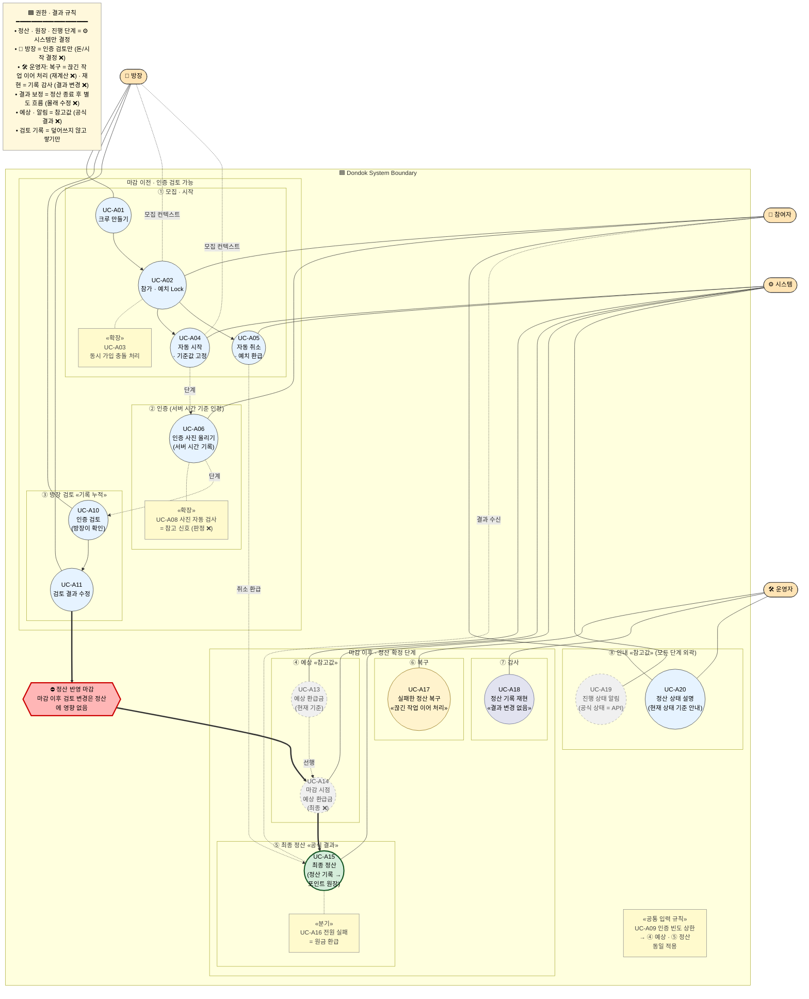

# Usecase Diagram: Dondok

> Dondok 행동 흐름(Usecase) 한눈에 보는 지도. 누가(액터) → 무엇을(유스케이스) → 어떤 순서/권한 경계로 흐르는지 표현. Canonical 출처는 [`Usecase-dondok.md`](./Usecase-dondok.md). 본 문서는 그 4장 Usecase Inventory의 시각화 레이어이며 의미 권한을 추가/축소하지 않는다.
>
> 우선순위: **strict UML purity < 행동 흐름 readability < 권한 경계 보존**. UML 표준 stereotype을 일부 양보하더라도 "누가 무엇을 어디까지 결정하는가"를 drift 없이 보여주는 것이 더 중요하다.

## 1. 액터

| 액터 | 역할 | 권한 경계 |
|---|---|---|
| 👑 방장 (Host) | 크루 설정, 인증 검토 | 돈/원장/진행 단계 권한 없음 |
| 🙋 참여자 (Participant) | 가입, 예치, 인증 업로드 | 정산 결과 수신·분쟁 주체 |
| ⚙️ 시스템 (System) | 진행 단계 전이, 정산 엔진, 원장 | 진행 단계/정산/원장 권한 단일 보유 |
| 🛠️ 운영자 (Admin/Support) | 정산 복구, 정산 재현, 상태 설명 | 결과 변경 권한 없음 (설명 layer · 결정 layer 아님) |

## 2. 다이어그램



> 렌더 verification: ⑧ OPS lane 위치는 Mermaid renderer 의존적이다. 과도하게 아래로 밀리면 fallback으로 OPS를 `subgraph Dondok` 밖 별도 swimlane으로 이동한다.

## 3. 다이어그램 읽는 법

### Layer · 색상 규칙

| 색상 | 의미 | 적용 노드 |
|---|---|---|
| 🟦 light blue | 표준 UC (액터가 직접 수행) | UC-A01, A02, A04, A05, A06, A10, A11, A20 |
| 🟢 strong green | «공식 결과» (최종 권한) | UC-A15 |
| ⬜ gray dashed | «참고값» (hint, 공식 결과 ❌) | UC-A13, A14, A19 |
| 🟡 yellow | «복구» (끊긴 작업 이어 처리, 결과 변경 없음) | UC-A17 |
| 🟪 lilac | «감사 재현» (당시 기준 재현, 결과 변경 없음) | UC-A18 |
| 🟨 cream | «확장» / «분기» / «공통 입력 규칙» (의미 수식자) | UC-A03, A08, A09, A16 |
| 🟥 red boundary | «고정 경계» — 정산 반영 마감 | FREEZE block |

### Edge / Stereotype 기호

| 기호 | 의미 |
|---|---|
| `───` 실선 | 액터가 직접 수행/책임 보유 (강한 association) |
| `┄┄ "context"` 점선 + 라벨 | 약한 컨텍스트 관계 (방장 모집 컨텍스트, 참여자 결과 수신 등) |
| `==>` 굵은 실선 | 진행 단계 전이 (마감 경계 통과 포함) |
| `-. 단계 .->` 점선 | 단계 진행 (실행 순서 시사, 권한 아님) |
| «확장» | 기본 UC의 특수/edge 동작 (UC-A03, A08) |
| «분기» | 기본 결과의 분기 (UC-A16 전원 실패 = 원금 환급) |
| «공통 입력 규칙» | 예상·정산 동일 적용 rule (UC-A09) |
| «기록 누적» | history 누적, 덮어쓰기 금지 (③ MOD) |
| «공식 결과» / «참고값» | 권한 layer 명시 |
| «끊긴 작업 이어 처리» / «결과 변경 없음» | 복구/재현 invariant |
| «고정 경계» | 정산 반영 마감 boundary (FREEZE block) |

### 단계 진행

```
[마감 이전 · 인증 검토 가능]
   ① 모집·시작 → ② 인증 → ③ 방장 검토 (기록 누적)
                                  ↓
                       ⛔ 정산 반영 마감
                                  ↓
[마감 이후 · 정산 확정 단계]
   ④ 예상 (참고값) → ⑤ 최종 정산 (공식 결과)
                     ⑥ 복구 (재계산 없음) · ⑦ 감사 (결과 변경 없음)

[모든 단계 외곽] ⑧ 안내 (참고값)
[공통 규칙]      UC-A09 인증 빈도 상한 = ④ · ⑤ 동일 적용
```

## 4. 권한 경계 cheat sheet

| 오해 | 사실 | 근거 |
|---|---|---|
| 방장이 환급 결정 | ❌ 방장은 인증 검토만. 돈은 시스템 | Usecase-dondok §1.5, §2.6 / PRD §7.2 |
| 사진 업로드 = 인증 성공 | ❌ MissionLog 생성·서버 검증까지 필요 | UC-A06, PF-009 |
| 예상 환급금 = 받을 돈 | ❌ 참고값. 최종은 정산 기록 + 포인트 원장 | UC-A13/14/15, §2.3 |
| 재시도 = 다시 계산 | ❌ 끊긴 정산 작업 이어 처리. 금액 불변 | UC-A17, §2.5, PF-013 |
| 재현 = 결과 수정 | ❌ 당시 기준 재현(감사용). 결과 불변 | UC-A18, §2.5 |
| 알림 = 최종 상태 | ❌ 알림은 참고값. 공식 상태는 API 응답 | UC-A19, §2.8 |
| 전원 실패 = 0원 환급 | ❌ 원금 환급. 누군가의 실패가 다른 수익으로 가지 않음 | UC-A16, §1.5, PF-017 |
| 마감 기준 예상 = 최종 | ❌ 마감 시점 예상. 최종 정산과 다를 수 있음 | UC-A14, PF-002 |
| 방장 승인 = 가입 권한 | ❌ 방장 승인 = 모집 컨텍스트. 가입/예치 = 참여자 + 시스템 | UC-A02 actor list, §2.6 |
| 보정 = 결과 덮어쓰기 | ❌ 정산 종료 후 별도 보정 흐름. 몰래 수정 금지 | UC-A12, §1.5, §2.4 |

## 5. 정합성 체크리스트

다이어그램 수정 시 canonical semantic이 깨지지 않았는지 확인:

**Authority boundary**
- [ ] 방장 실선이 UC-A15(최종 정산), UC-A16, UC-A17, UC-A18에 없음
- [ ] 방장 → UC-A02는 점선 `모집 컨텍스트` 약화 유지 (실선 금지)
- [ ] 방장 → UC-A04는 점선 `모집 컨텍스트` 약화 유지 (실선 금지)
- [ ] 시스템 실선은 진행 단계/정산/알림 발송 UC에만 (UC-A04, A05, A13, A14, A15, A19)
- [ ] 운영자 실선은 UC-A17(복구), UC-A18(재현), UC-A20(상태 설명)에만
- [ ] 참여자 → UC-A15는 점선 `결과 수신` 유지 (실선 금지)

**Boundary · invariant 시각화**
- [ ] FREEZE block이 PRE/POST band 사이 굵은 빨간 separator로 존재
- [ ] PRE wrapper 라벨 `마감 이전 · 인증 검토 가능` 유지
- [ ] POST wrapper 라벨 `마감 이후 · 정산 확정 단계` 유지
- [ ] ③ MOD subgraph 라벨에 «기록 누적» 유지
- [ ] ④ PROJ subgraph 라벨에 «참고값» 유지
- [ ] ⑤ SETL subgraph 라벨에 «공식 결과» 유지

**의미 수식자 (Semantic modifier)**
- [ ] UC-A09는 floating «공통 입력 규칙», ④↔⑤ 직접 화살표 없음 (causal read 차단)
- [ ] UC-A03, UC-A08, UC-A09, UC-A16 모두 `ext` classDef 단일 적용 (스타일 통일)
- [ ] UC-A16 라벨이 `원금 환급` 유지 (0원/몰수 wording 금지)
- [ ] UC-A08 라벨에 `참고 신호` 유지 (판정 wording 금지)

**복구 · 재현 · 보정 분리**
- [ ] UC-A17 라벨에 «끊긴 작업 이어 처리» 유지
- [ ] UC-A18 라벨에 «결과 변경 없음» 유지
- [ ] UC-A17 → UC-A18 직접 화살표 없음 (sequential interpretation 차단)
- [ ] ⑥ 복구 / ⑦ 감사 lane 분리 유지
- [ ] Legend에 복구/재현/보정 invariant 줄 모두 유지

**공식 결과 출처 명시**
- [ ] UC-A15 라벨에 `정산 기록 → 포인트 원장` 유지

**제거되어야 할 노드 (재도입 금지)**
- [ ] UC-A07 단독 노드 없음 (UC-A06 라벨에 흡수됨)
- [ ] UC-A12 단독 노드 없음 (FREEZE invariant block으로 승격됨)

## 6. 참조

- [`docs/Usecase-dondok.md`](./Usecase-dondok.md) — canonical behavioral semantics (4장 Usecase Inventory, 5장 Pressure-Test Findings, 7장 Unresolved Semantic Registry)
- [`docs/PRD-dondok.md`](./PRD-dondok.md) — canonical synthesis layer
- [`docs/Settlement-design.md`](./Settlement-design.md) — 정산 권한/재현/복구 상세
- [`docs/ERD-dondok.md`](./ERD-dondok.md) — 기록 누적(append-only) 데이터 모델
- [`docs/API-spec-dondok.md`](./API-spec-dondok.md) — 외부 계약/wording
