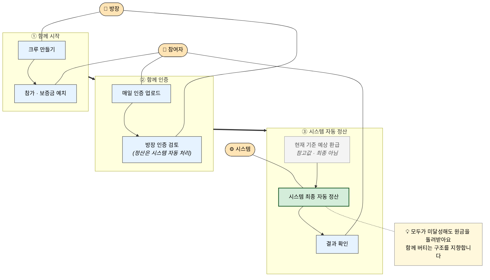

# Usecase Diagram (External Share Version)

> 외부 공유·발표·README·onboarding용 간소화 다이어그램. "누가 무엇을 어디까지 하는 서비스인가"를 10초 안에 전달하는 것이 목적이다. 내부 semantic verification artifact는 [`Usecase-diagram-dondok.md`](./Usecase-diagram-dondok.md)에 분리되어 있다.

방장은 인증만 검토하고, 최종 정산은 시스템이 자동으로 처리합니다.
현재 기준 예상 환급금을 보며 함께 목표를 지속하는 구조를 지향합니다.

## 읽는 법

| 색상 | 의미 |
|---|---|
| 🟧 살구색 | 액터 (방장 / 참여자 / 시스템) |
| 🟦 파랑 | 일반 단계 |
| ⬜ 회색 | 참고값 (예상 환급 — 최종 아님) |
| 🟢 진한 초록 | 최종 자동 정산 (시스템 단독 권한) |
| 🟨 노랑 | 협업 안내 |

## 핵심 약속

- **방장**: 인증 검토만 합니다. 환급·정산 권한은 없습니다.
- **참여자**: 보증금을 예치하고, 매일 인증을 올리고, 결과를 확인합니다.
- **시스템**: 정산은 시스템이 자동으로 처리합니다. 사람이 결과를 바꾸지 않습니다.
- **전원 미달성**: 모두에게 원금을 돌려드립니다. 누군가의 실패가 다른 사람의 수익이 되는 구조가 아닙니다.

## 더 자세한 내용

- [`Usecase-diagram-dondok.md`](./Usecase-diagram-dondok.md) — 내부 검증용 semantic diagram (authority boundary · freeze · retry/replay 등 상세)
- [`Usecase-dondok.md`](./Usecase-dondok.md) — usecase 인벤토리 (canonical behavioral semantics)
- [`PRD-dondok.md`](./PRD-dondok.md) — 제품 요구사항 종합
